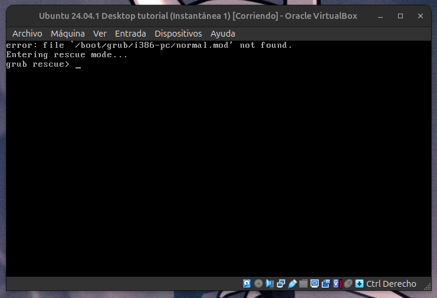
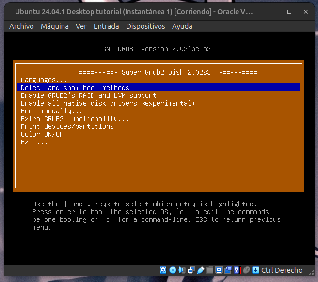
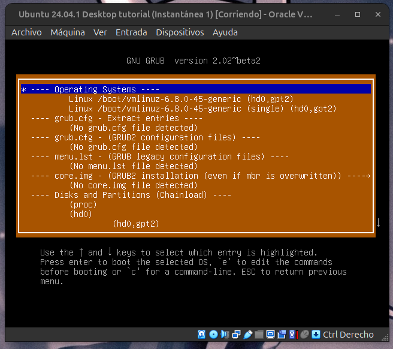
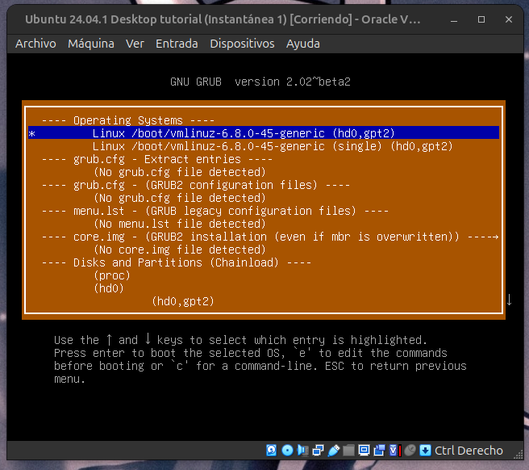
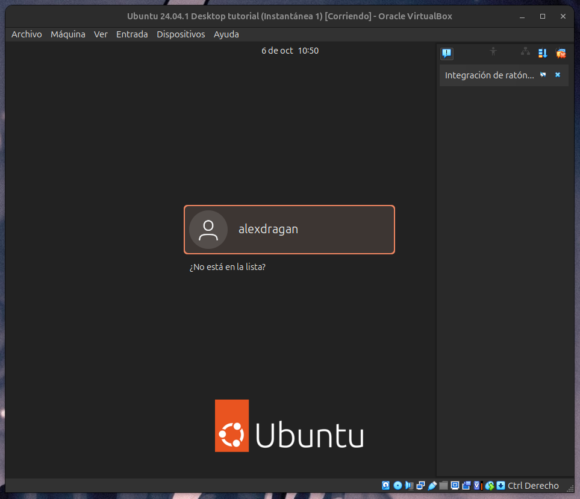
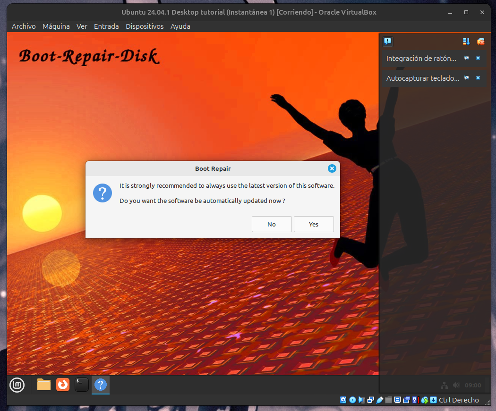
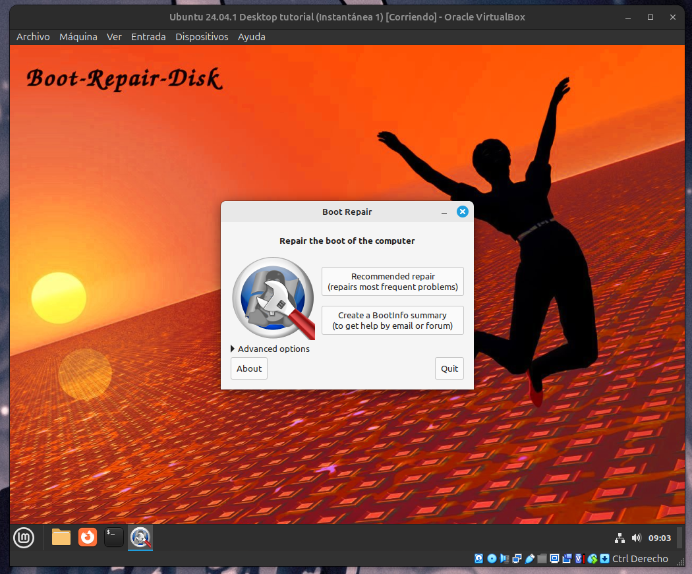
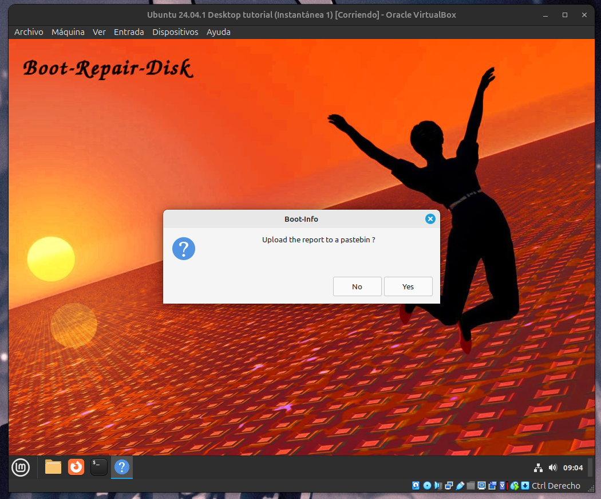
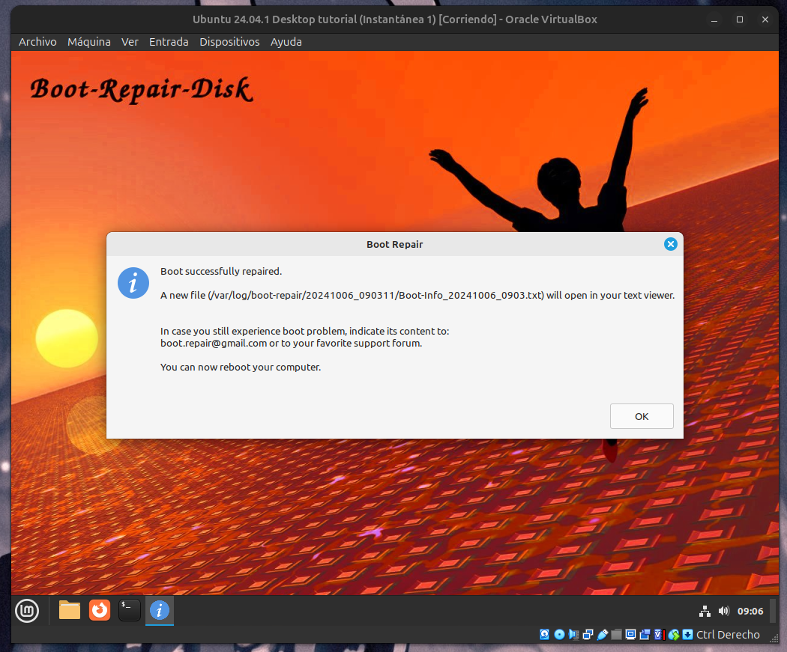
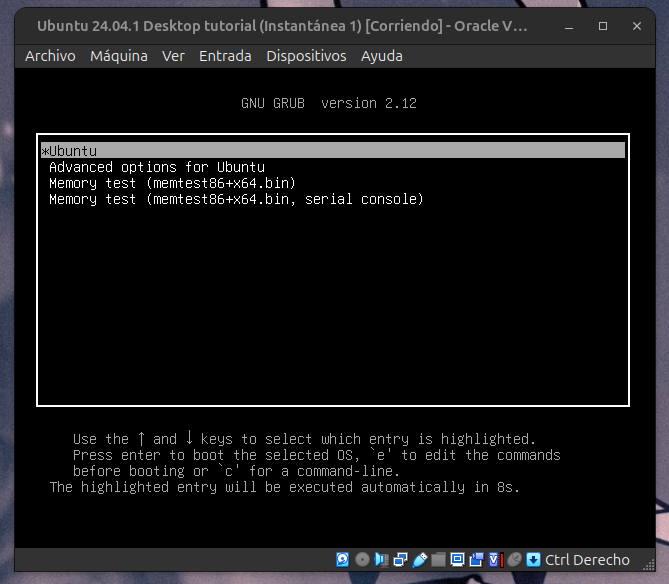

# Reparacion de grub
Por si algún motivo se te ha roto el grub o lo has borrado porque si con uno de estos métodos lo puedes reparar.

## Metodo 1: Grub 2 iso

Descargamos la iso de grub 2 en este enlace: [https://www.supergrubdisk.org/category/download/](https://www.supergrubdisk.org/category/download/). Si es en un físico, pon la iso en un bootable.

Ponemos la ISO en la máquina virtual.

Encendemos la máquina virtual otra vez.

Pulsamos la tecla enter.

Seleccionamos la primera opción

Pulsamos enter y esperamos. Si te ha funcionado, tendría que salirte la pantalla de inicio de sesión

## Metodo 2: Boot repair

Descargamos la iso de boot repair en este enlace: [https://sourceforge.net/projects/boot-repair-cd/](https://sourceforge.net/projects/boot-repair-cd/).

Pulsamos en que no.

Pulsamos en la primera opcion.

Pulsamos en no y esperamos.

Le damos al botón de ok, apagamos la máquina virtual, le quitamos la hizo y la volvemos a encender. Si te ha funcionado, tendría que salirte el grub.

