# Raid

El raid es una tecnologia que permite tener los mismos datos de un disco en otros discos que trabaja a nivel de discos y particiones.

Lo que se recomienda para hacer un raid es que los discos tengan las mismas caracteristicas. Hoy en dia se trabaja con volumenes

| RAID | | Discos | Tolerancia a fallos                      |
| :--: | | :----: | :--------------------------------------- |
| 0    | | 2      | Solo con fallar un disco ya no funciona. |
| 1    | | 2      | Si falla uno seguira funcionando.        |
| 5    | | 4      | Solo puede fallar un disco.              |

## Configuracion de raid

En mi caso creare un raid 5 que neceista como minimo 

Primero crearemos los discos duros pulsando click derecho en la maquina virtual y Configuracion o pulsando Configuracion

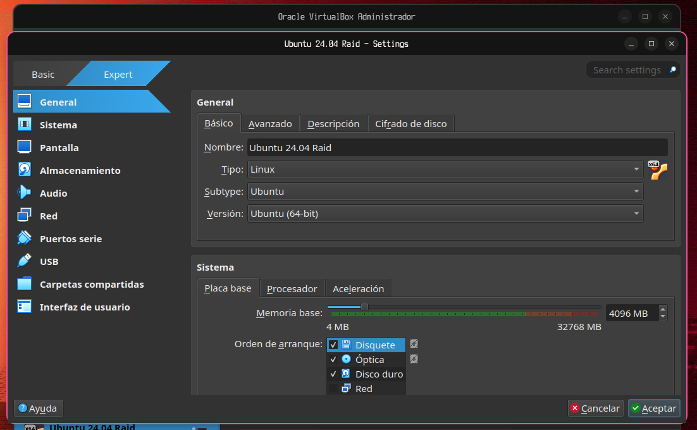

Vamos a almacenamiento.

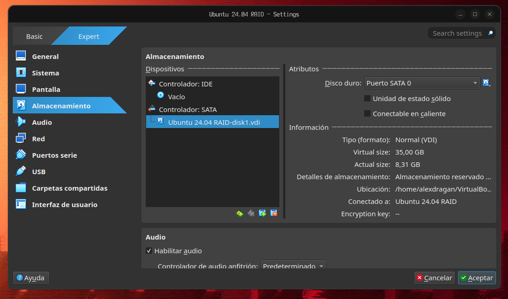

Pulsamos en el icono de un disco duro con un +.

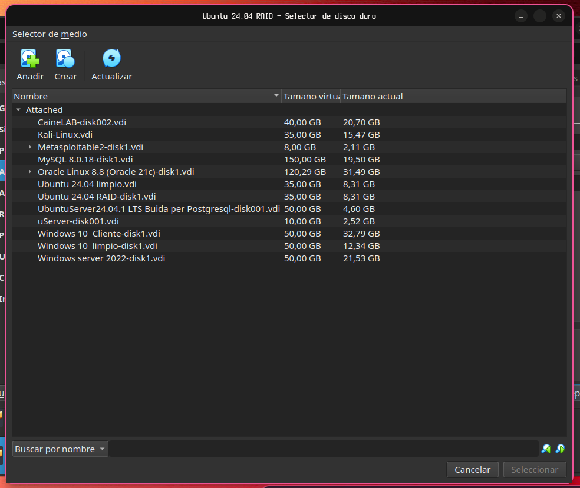

Pulsamos el icono del disco con un ciruclo y le asignamos el espacio.

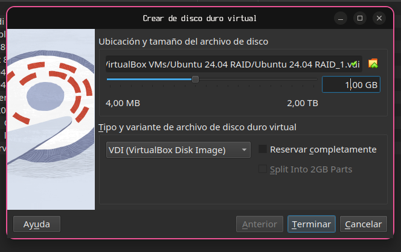

Pulsamos en terminar y los mismos pasos hasta crear la cantidad de disco que queramos.

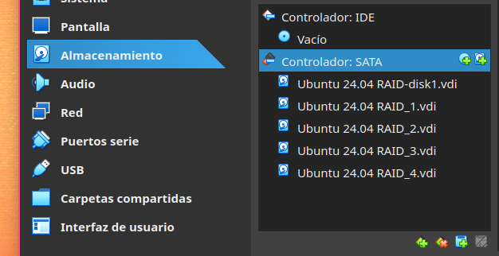

Guardamos los cambios y iniciamos la maquina.

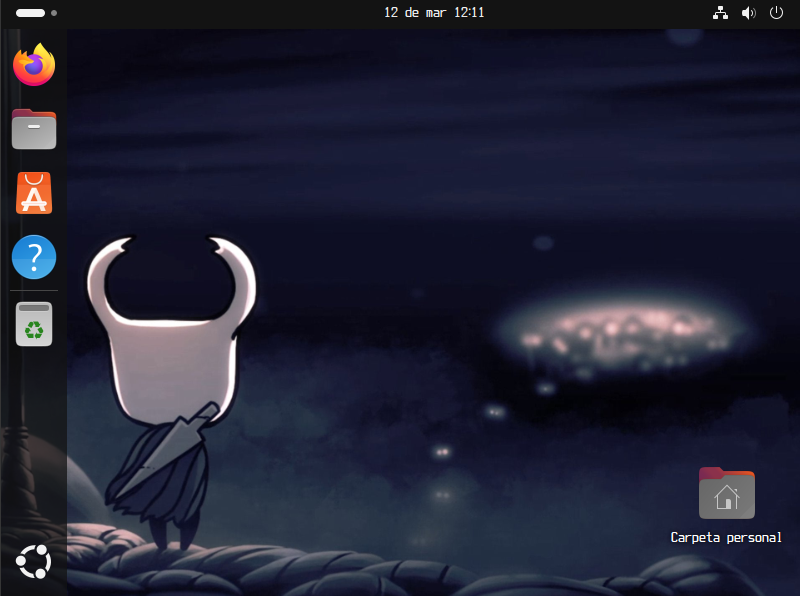

Abrimos una terminal pusando click derecho en el escritorio y pulsando abrir un terminal o pulsando ctr + alt + t

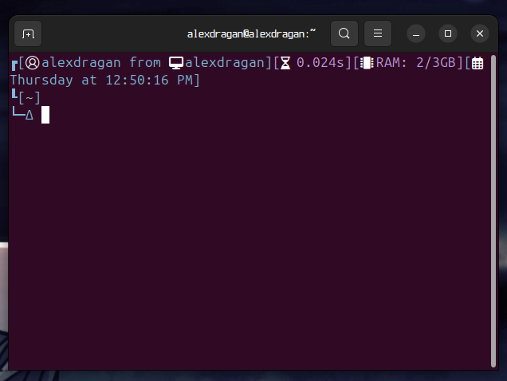

Ejecutamos primero sudo apt update

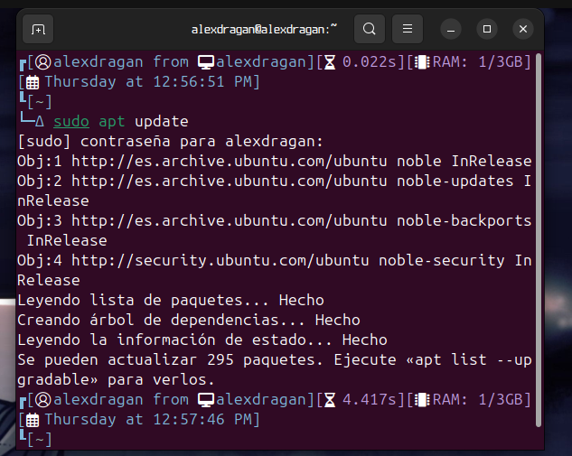

Y ahora instalamos mdadm

```
sudo apt install mdadm
```

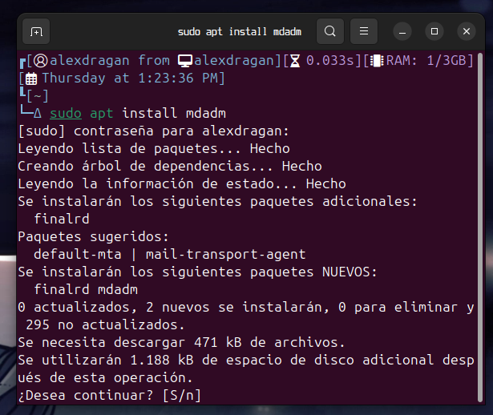

Pulsamos enter

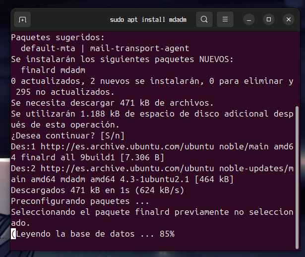

Una vez instalado hacemos fdisk -l para ver que letra tiene los discos

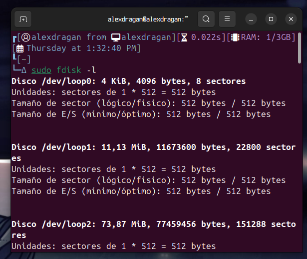

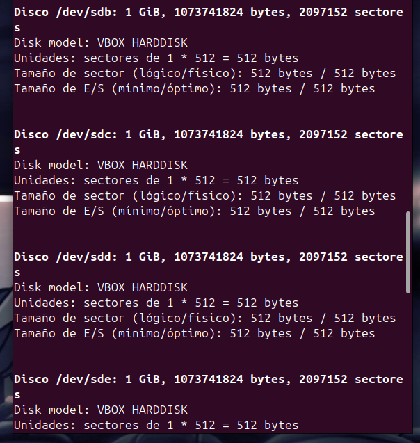

Ahora ejecutamos el fdisk indicando el disco para darle formato.

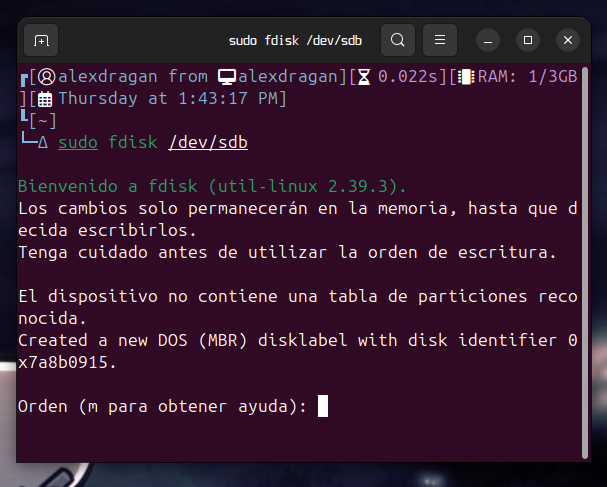

Escribimos n y pulsamos enter

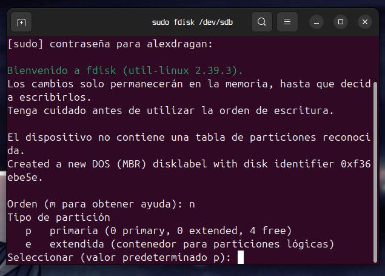

Seguimos pulsando enter hasta que vuelva a pedir que introduscamos una orden

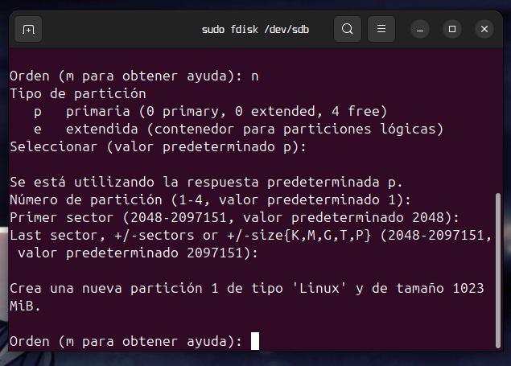

Escribimos t y pulsamos enter

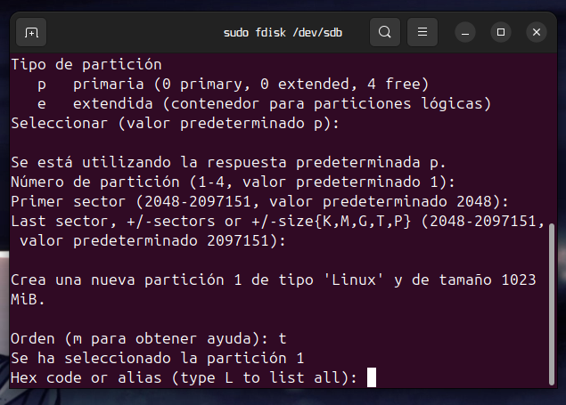

ahora escribimos fd y pulsamos enter.

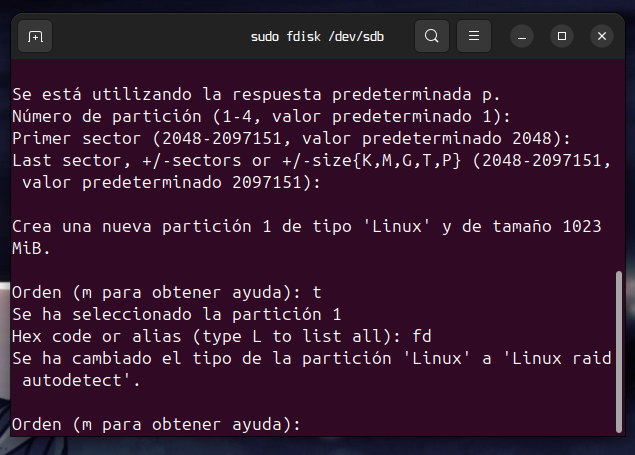

Escribimos w para guardar los cambios y repitimos los mismos pasos para la cantidad de discos que tengamos.


## Pruevas de fallos