# Monitoreo del sistema

## Informacion del sistema

### Aplicacion predeterminada

Podemos ver los processsos en ejecucion, el consumor de la  ram y la cpu

Pulsamos en los dos puntos de la parte superior izquierda.

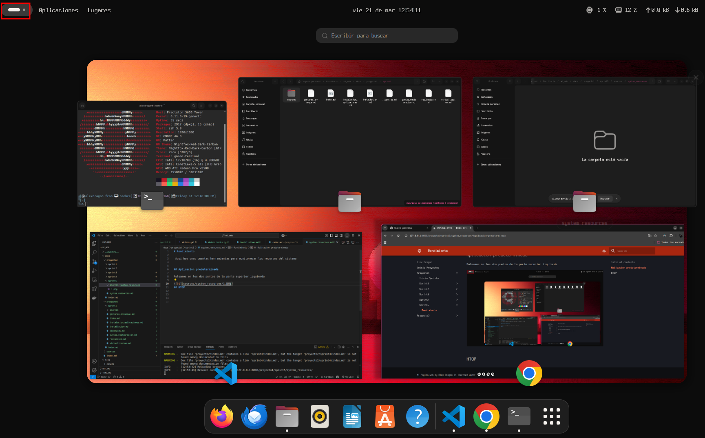

Pulsamos en los puntos de la barra de abajo.

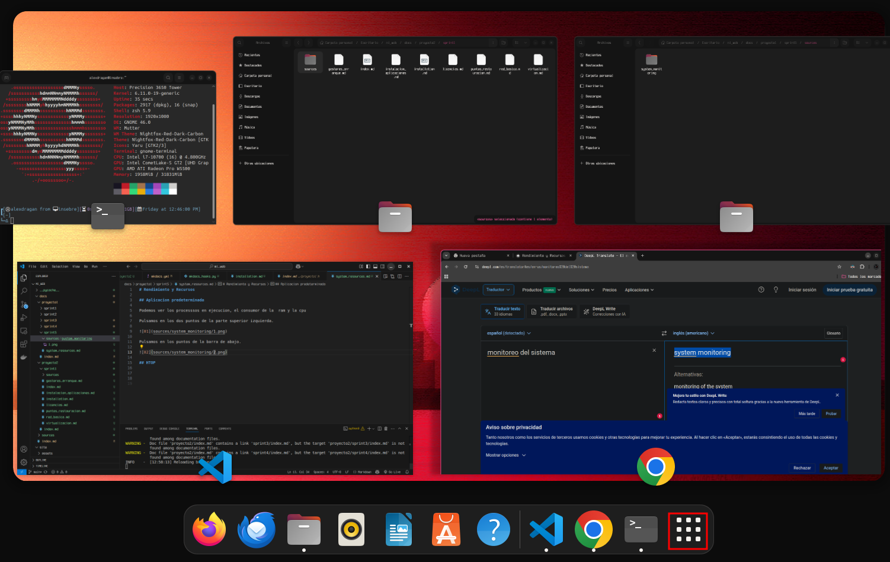

Buscamos el icono del programa 

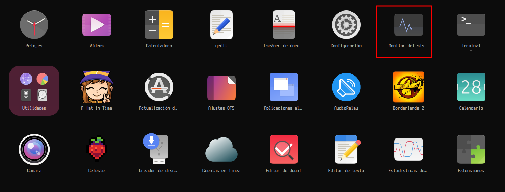

Pulsamos en el icono para abrirlo.

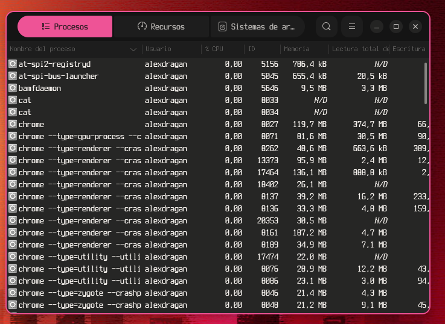

Apartado principal es el de procesos el siguiente recursos donde podremos ver cuanto se esta consumiendo

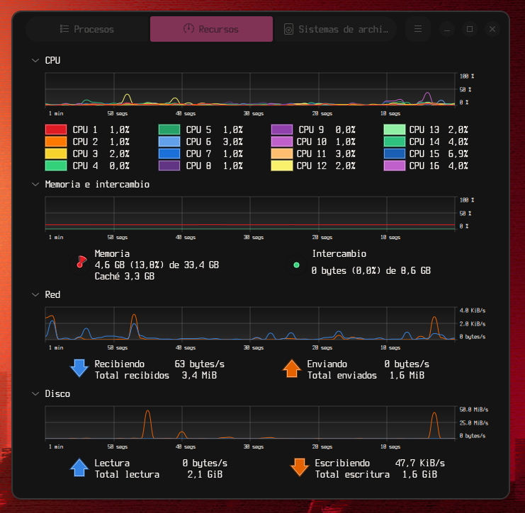

Por ultimo tenemos el de disco para ver cuanto espacio esta ocupado.

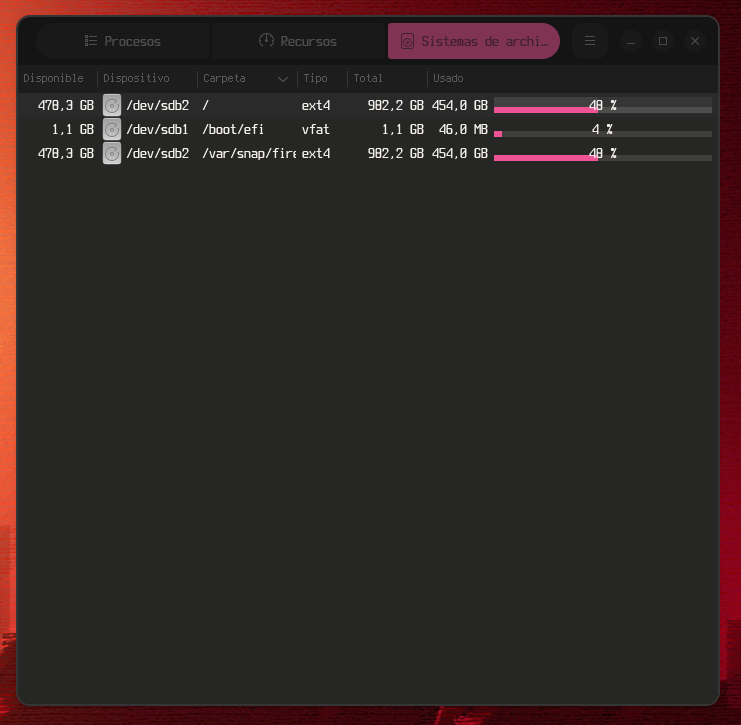

### HTOP

Hacemos un apt update 

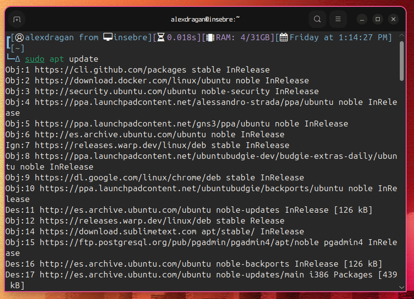

Ahora hacemos un sudo apt install htop.

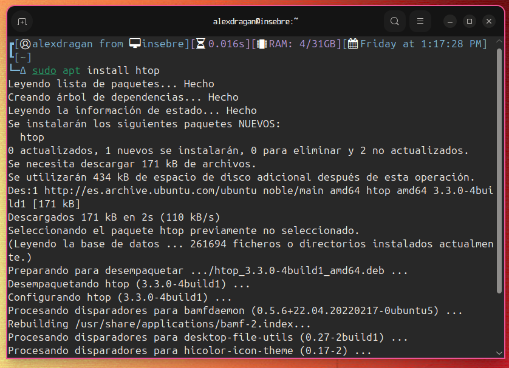

Una vez terminado de instalar podemos ejecutar el programa escribiendo htop en el terminal o buscandolo htop en el mismo sitio que la aplicacion predeterminada.

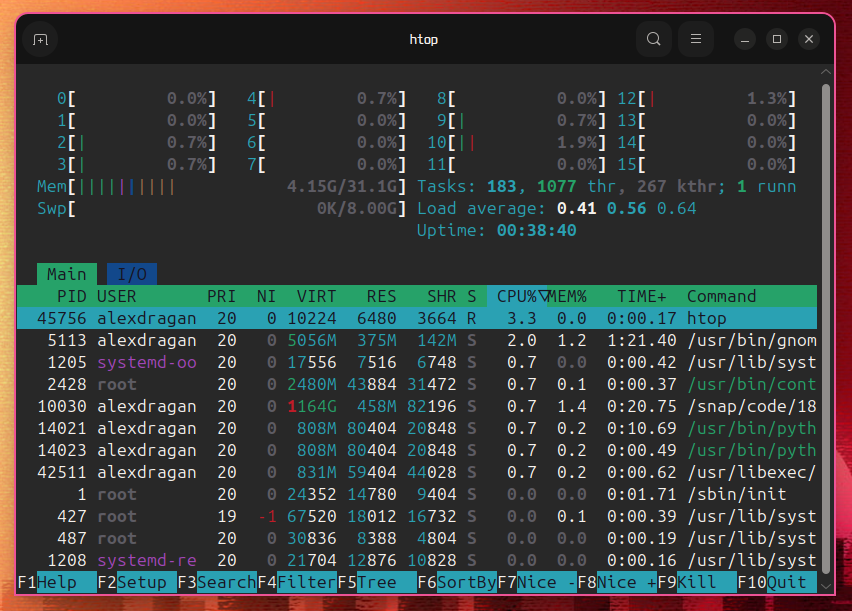

Tienes varias opciones que puedes hacer click o pulsar la tecla correspondiente.

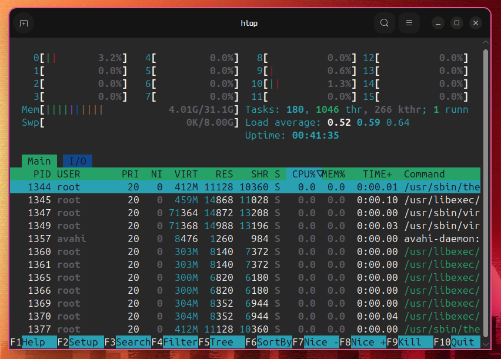

## LOGS

### Journalctl

Ejecutando el comando journalctl podras ver los registros del equipo.

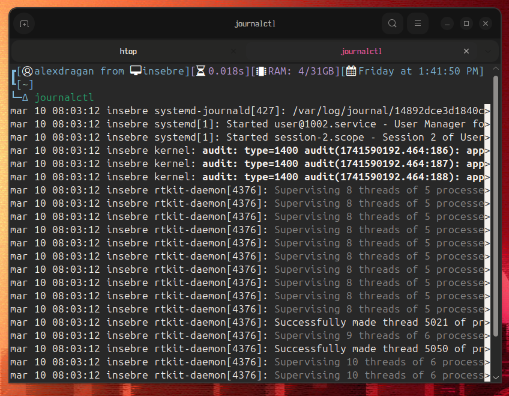

Agregando -h puedes mirar los parametros que le puedes poner.

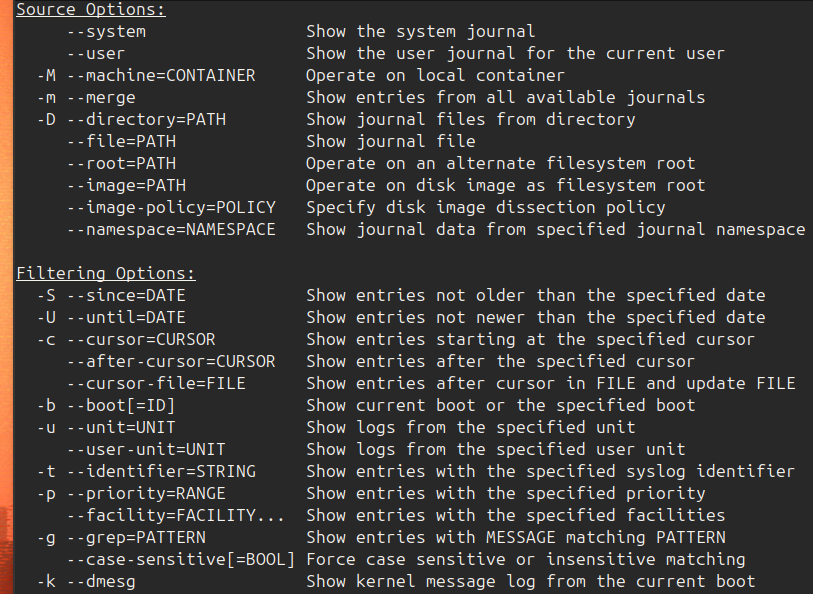

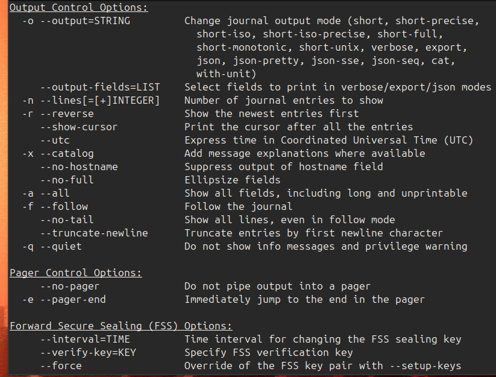

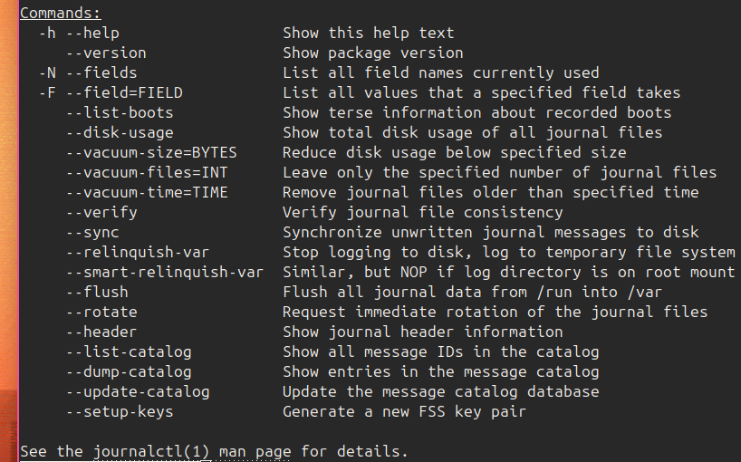

