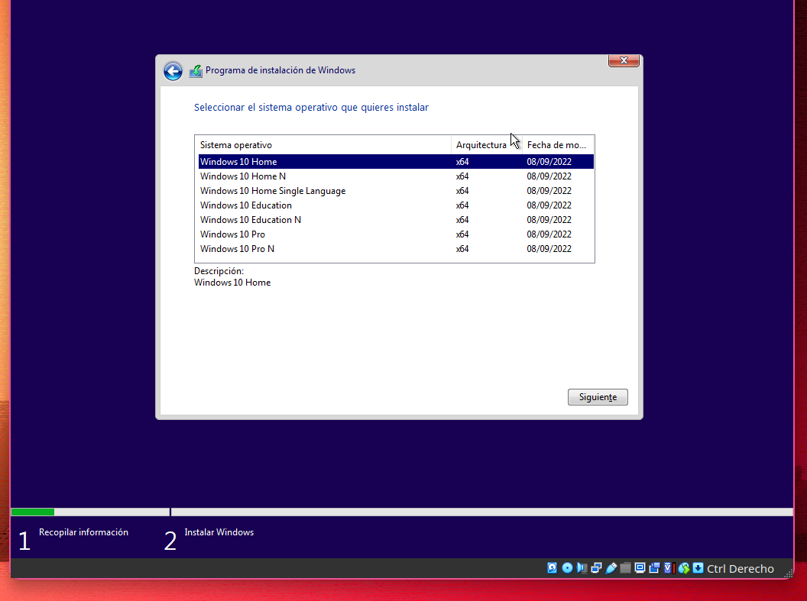

# Instalacion windows 

# Cliente

Creamos una maquina virtual con la iso de windows y la iniciamos.

Pulsamos en siguiente. (Consejo: Para tener el windows mas limpio en formato y moneda puede elegir ingle internacional. Luego una vez instalado lo puedes cambiar)

Pulsamos en instalar ahora.

Pulsamos en no tengo clave

# Server