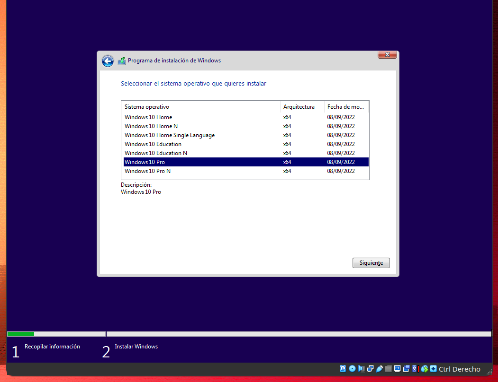
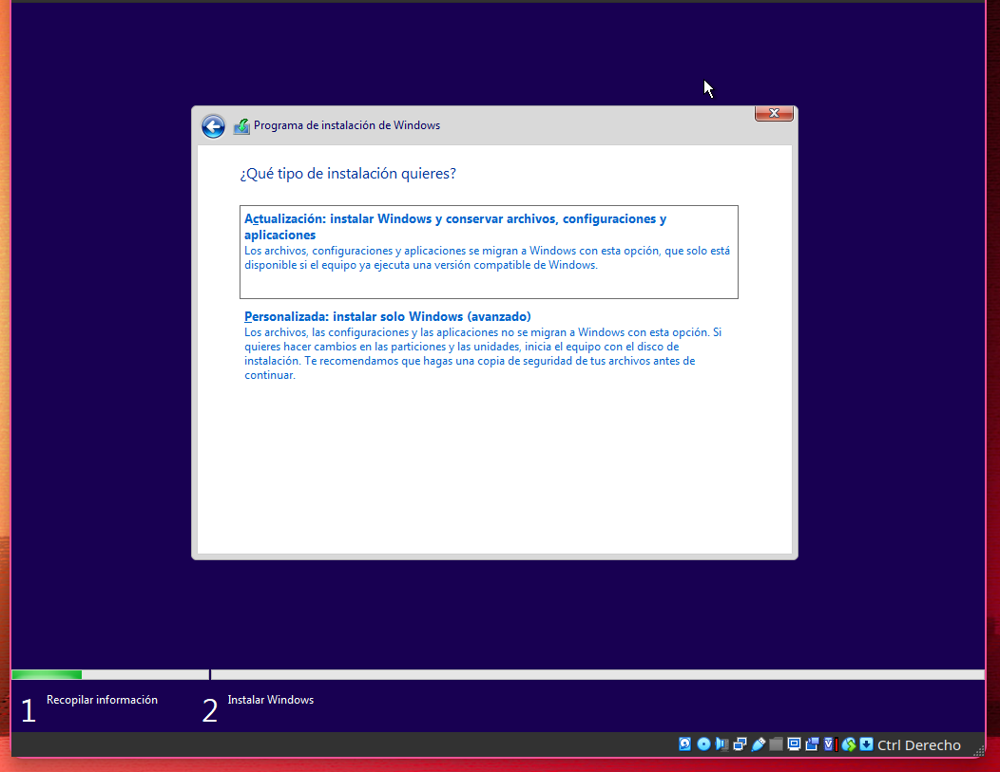
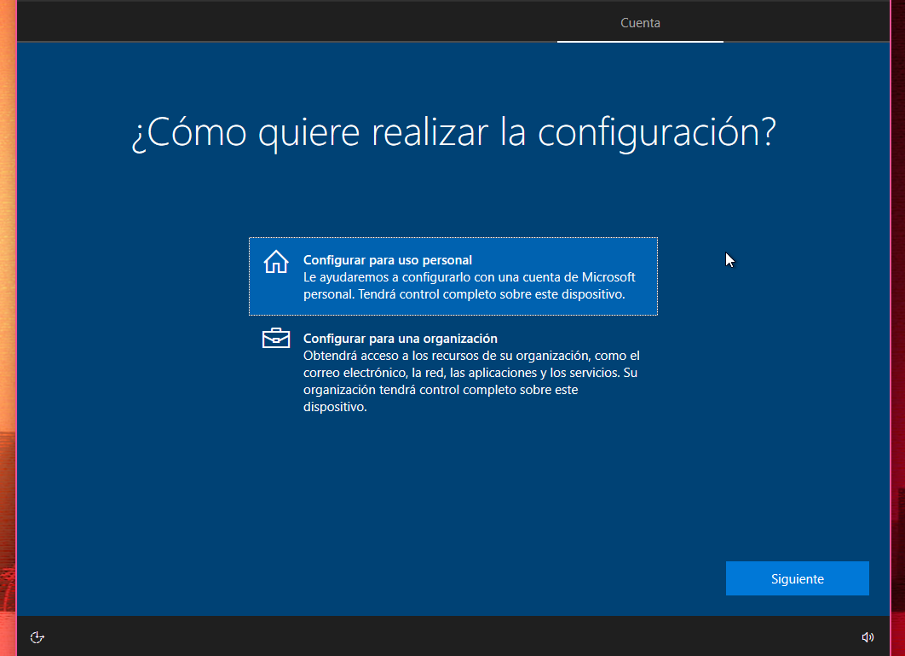

# Instalación

## Requisitos

## Windows Cliente

## Windows Server

### CPU

### RAM

### Almacenamiento

### Red

## Instalacion windows 

### Cliente

Creamos una máquina virtual con la ISO de Windows y la iniciamos.

Pulsamos en siguiente. (Consejo: Para tener el Windows más limpio en formato de hora y moneda puedes elegir inglés internacional. Luego una vez instalado lo puedes cambiar)

Pulsamos en instalar ahora.

Pulsamos en no tengo clave

Seleccionamos Windows 10 pro.

Pulsamos en siguiente.

Aceptamos los términos y condiciones (Que casi nadie lee, incluido yo)

Pulsamos en la opción Personalizada.

En caso de crear una partición, pulsamos en nuevo.

Ponemos la cantidad que le queremos asignar en megabytes.

Pulsamos en aplicar.

Pulsamos en aceptar.

Pulsamos en siguiente.

Esperamos a que termine.

Pulsamos en si.

Volvemos a pulsar en si.

Pulsamos en omitir.

Volvemos a esperar.

Selecinamos una de las dos opciones

Pulsamos en siguiente

Pulsamos en cuenta sin conexion.

Pulsamos en experiencia limitada.

Ponemos el nombre que queramos 

### Server