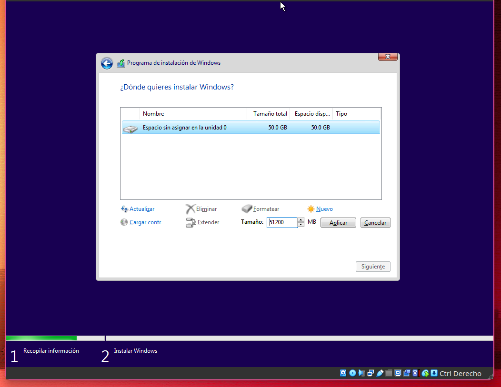
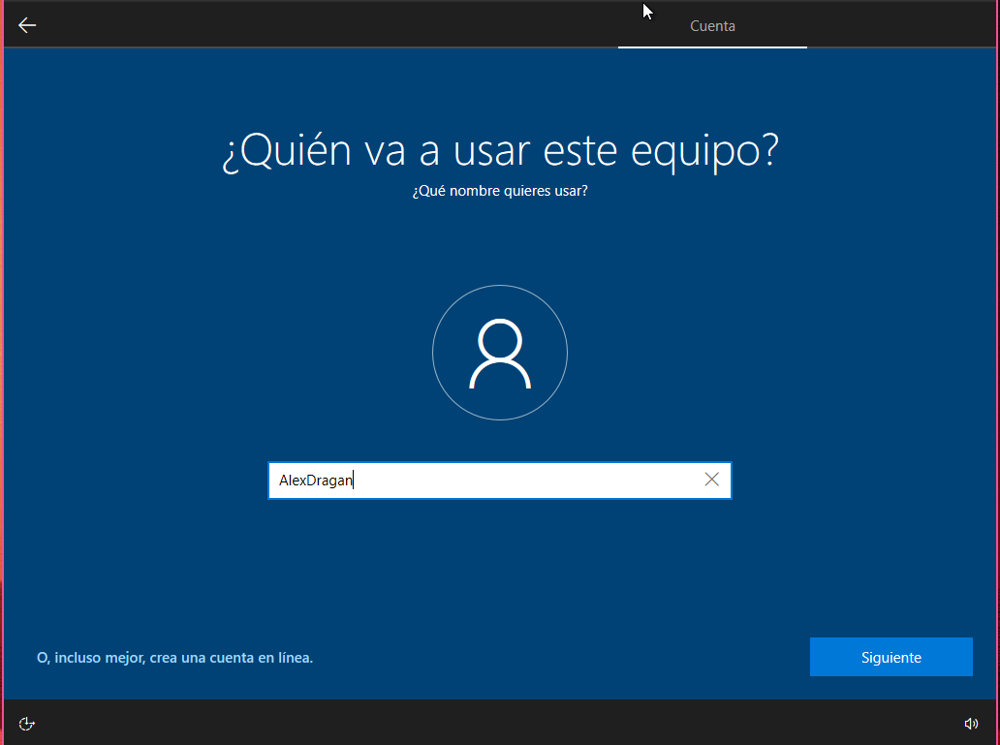
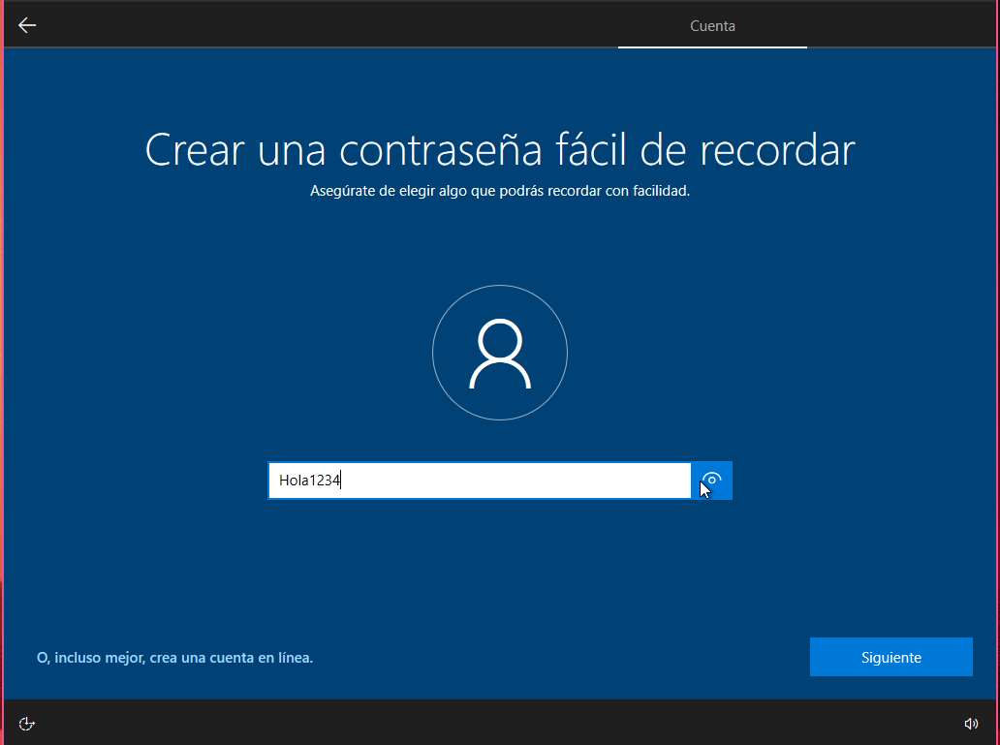
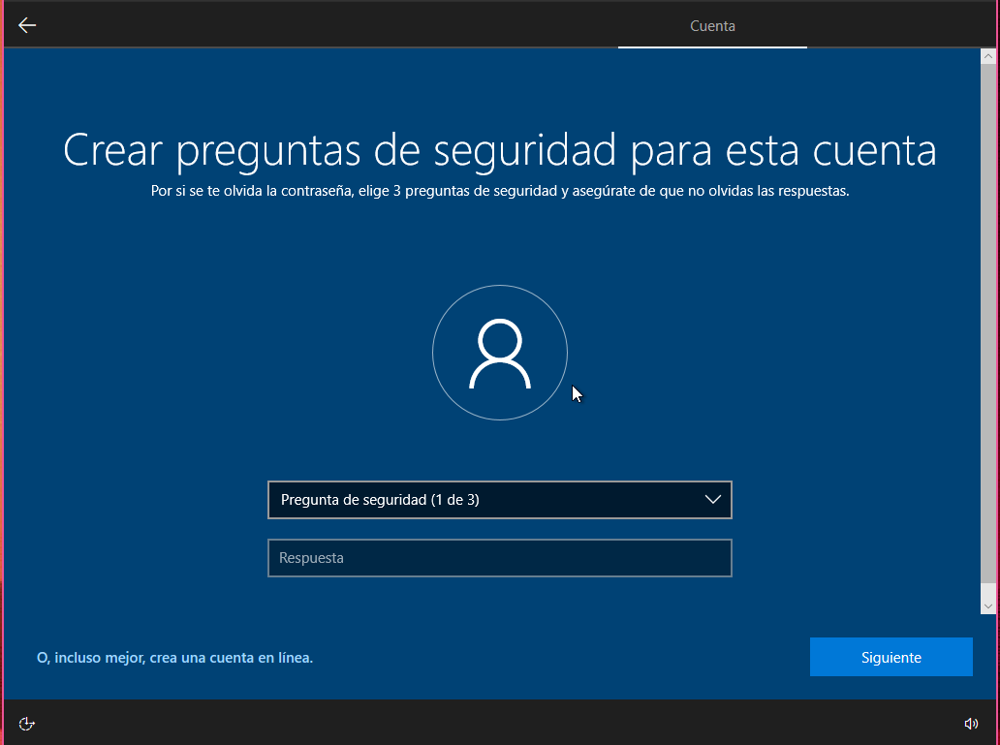
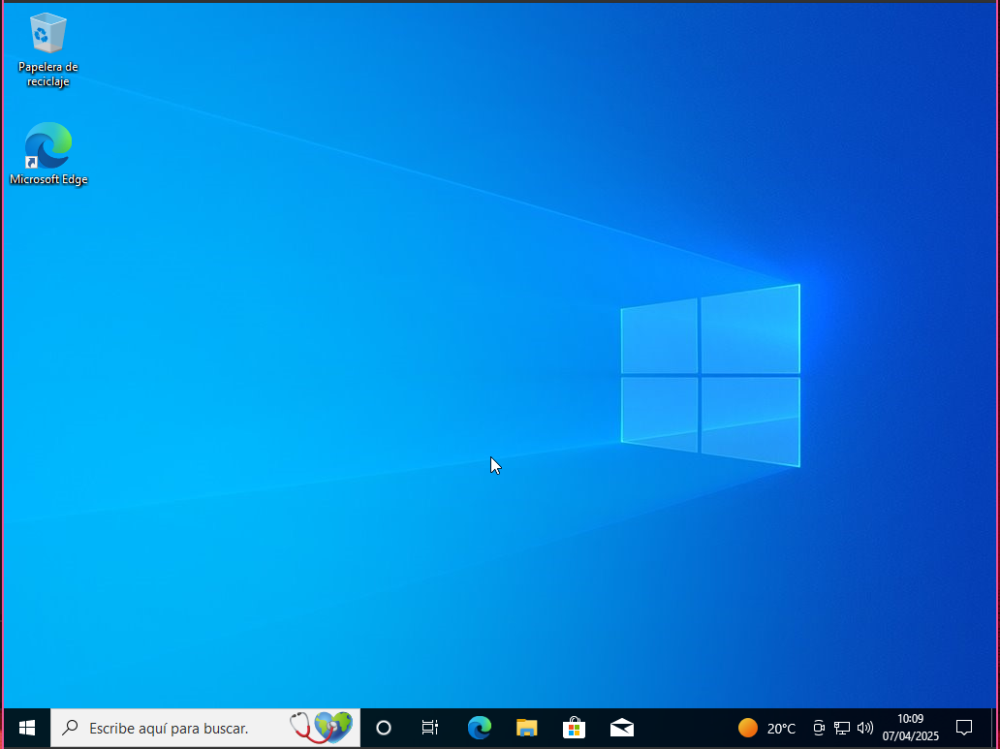
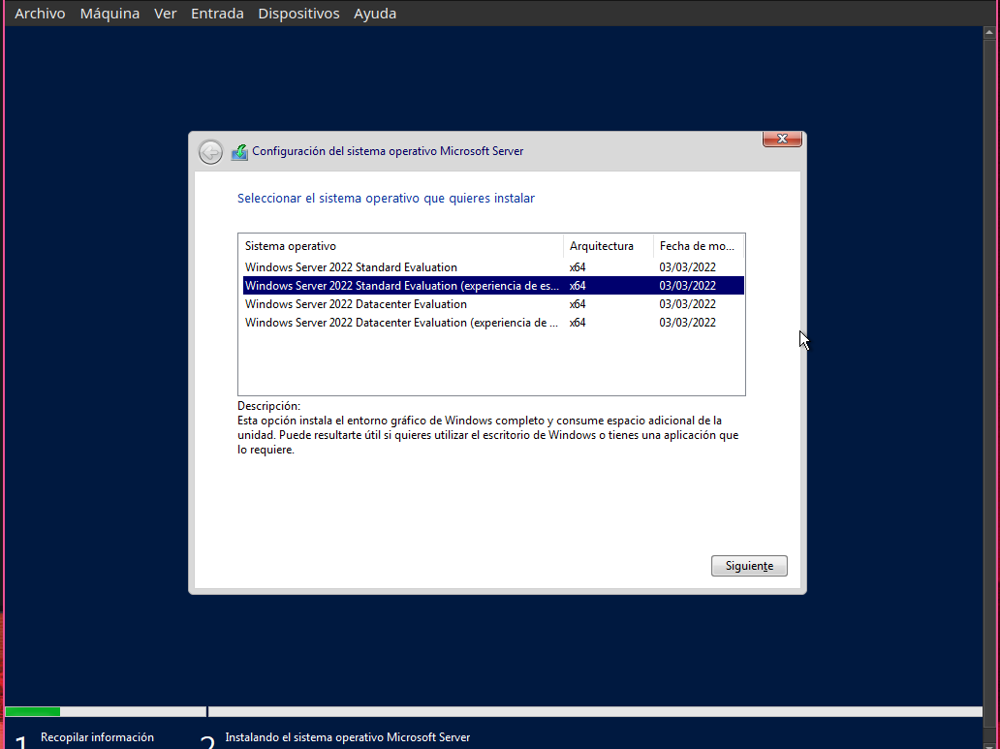
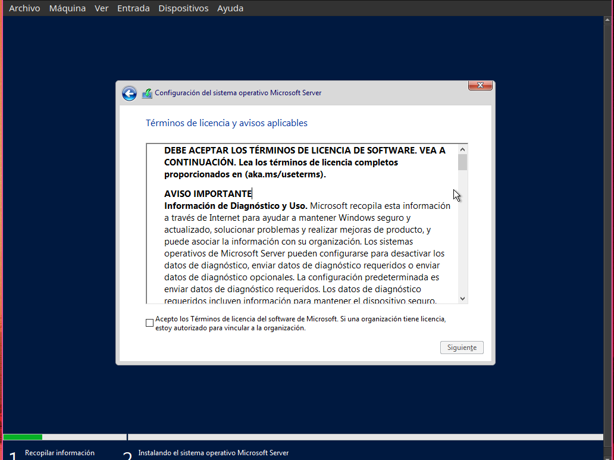
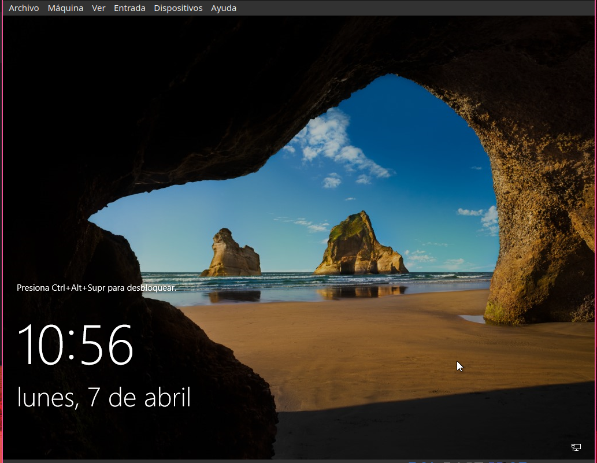
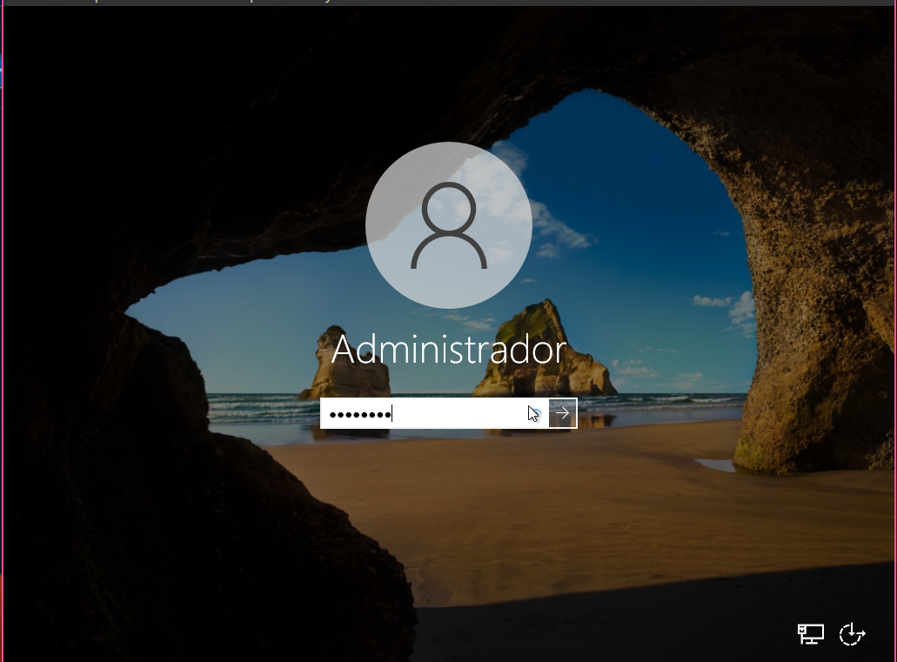

# Instalación

## Requisitos

## Windows Cliente

## Windows Server

### CPU

### RAM

### Almacenamiento

### Red

## Instalacion windows 

### Cliente

Creamos una máquina virtual con la ISO de Windows, desmarcamos la opcion de instalacion desatendida y la iniciamos.

Pulsamos en siguiente. (Consejo: Para tener el Windows más limpio en formato de hora y moneda puedes elegir inglés internacional. Luego una vez instalado lo puedes cambiar)

Pulsamos en instalar ahora.

Pulsamos en no tengo clave

Seleccionamos Windows 10 pro.

Pulsamos en siguiente.

Aceptamos los términos y condiciones (Que casi nadie lee, incluido yo)

Pulsamos en la opción Personalizada.

En caso de crear una partición, pulsamos en nuevo.

Ponemos la cantidad que le queremos asignar en megabytes.

Pulsamos en aplicar.

Pulsamos en aceptar.

Pulsamos en siguiente.

Esperamos a que termine.

Pulsamos en si.

Volvemos a pulsar en si.

Pulsamos en omitir.

Volvemos a esperar.

Selecinamos una de las dos opciones

Pulsamos en siguiente

Pulsamos en cuenta sin conexion.

Pulsamos en experiencia limitada.

Ponemos el nombre que queramos 

En la siguiente pantalla pondrmeos la contraseña.

En la siguiente pantalla tendremos que confirmar la contraseña.

En la siguiente pantalla tendremos que poner 3 preguntas de seguridad.

Pulsamos en siguiente.

Selecinamos si queremos importar datos viejos. En mi caso pulsare que no.

Pulsaremos que no y aceptar a las siguientes cosas que pregunte

Pulsaremos en enviar datos requeridos.

Seguimos diciendole que no

Aqui podemos selecionar el uso que le daremos al equipo o omitir.

En este menu podemos decidir si queremos que el asistente nos ayude

Pulsaremos en que ahora no. Esperamos a que termine la instalacion.

### Server

Creamos una maquina virtual igual que en el windows cliente y la iniciamos.

Pulsamos en siguiente

Pulsamos en instalar ahora y esperamos.

Aqui elegimos la edicion que queramos usar yo usare la standard con experiencia de usuario.

Pulsamos en siguiente.

Aceptamos los terminos y condiciones. Pulsamos en siguiente.

Pulsamos en personalizar. En este menu si queremos podemos crear particiones.

Como no quiero crear ninguna particion ahora pulsare en siguiente.

Esperamos.

Pulsamos en reinicia ahora y esperamos. Aqui nos pedira que pongamos la contraseña

Pulsamos en finalizar.

Pulsamos derecho ctrl + supr para abrir el panel para iniciar sesion.

Pulsamos enter.

