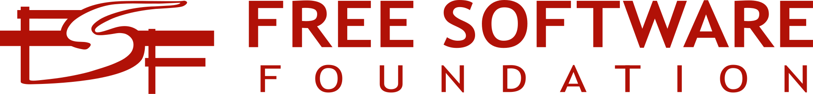
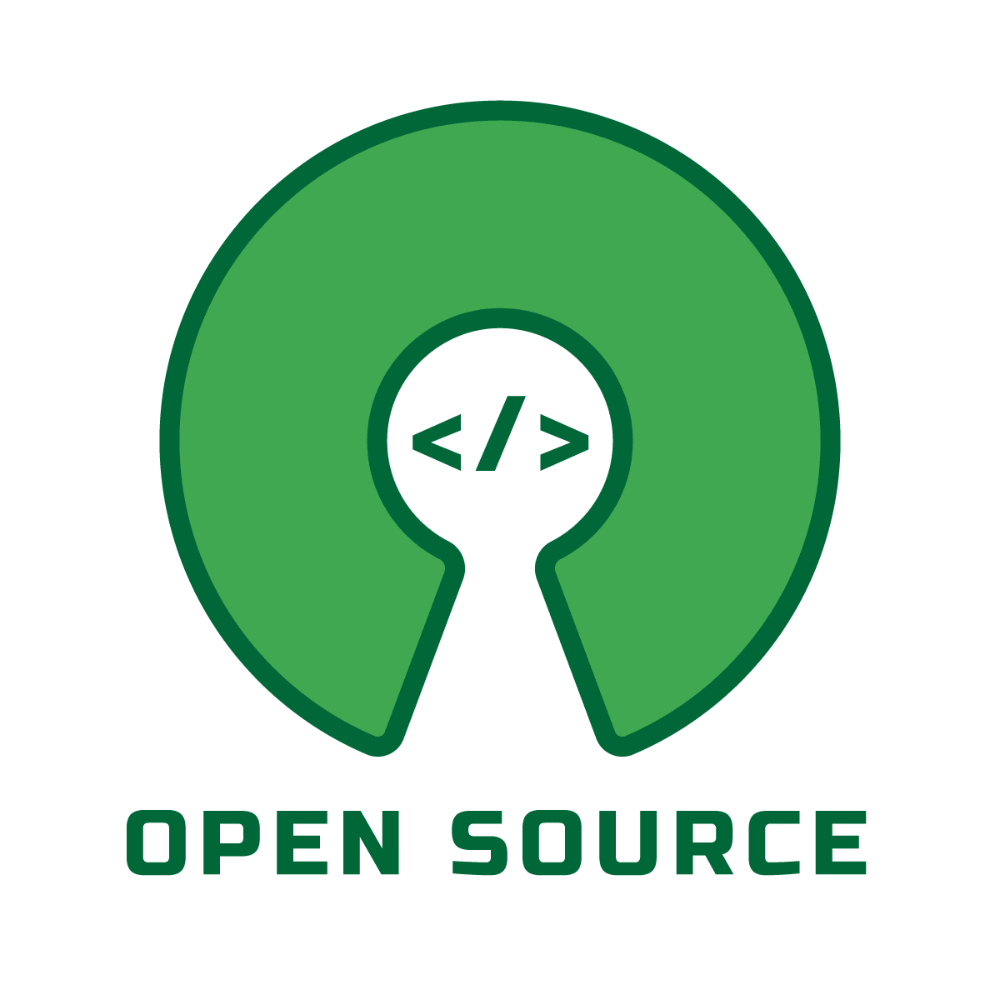
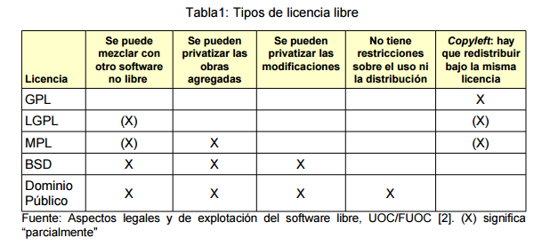

# Licencias

## Licenciamiento: Definiciones y Conceptos Clave

Un contrato entre el programador y el usuario que define los derechos y deberes de cada parte. El programador decide el tipo de licencia bajo la cual se distribuirá el software.

## Software Libre (SL)

Debe cumplir con las siguientes cuatro libertades:

Usarlo sin restricciones.

Estudiarlo y adaptarlo a las necesidades del usuario.

Redistribuirlo.

Mejorarlo y compartir las modificaciones.

Nota importante:

Para cumplir con estas libertades, es imprescindible tener acceso al código fuente.

El software libre se refiere a libertades, no a precio.

Puede distribuirse bajo diferentes tipos de licencias.

Las licencias libres no deben imponer restricciones que contradigan las cuatro libertades.

## Fundaciones y Organizaciones

[FSF (Free Software Foundation)](https://es.wikipedia.org/wiki/Free_Software_Foundation): Organización que promueve el software libre. Más información.

[OSI (Open Source Initiative)](https://opensource.org/licenses): Promueve el software de código abierto. Licencias OSI.

## Tipos de Software

Software de dominio público: No requiere licencia, puede ser usado por toda la humanidad sin restricciones legales, siempre mencionando al autor original.

Software semilibre: Conserva características del SL para uso personal o educativo sin fines comerciales, pero restringe su uso comercial.

Software gratuito (freeware): Puede redistribuirse libremente, pero no modificarse porque no incluye acceso al código fuente.

Software propietario o privativo: Requiere permiso o pago para usar, modificar o redistribuir. También conocido como software no libre.

### Derechos de Autor y Propiedad Intelectual
Copyright: Protege los derechos del autor sobre su obra, permitiendo su explotación comercial bajo ciertas condiciones.

Copyleft: Garantiza que cualquier usuario pueda usar, modificar y redistribuir una obra derivada bajo las mismas condiciones que la original.

## Tipos de Licencias de Software

### Licencias de Software Propietario

### CLUF (Contrato de Licencia para el Usuario Final): Permite el uso del producto solo a un usuario específico.

### Licencias RDS (Remote Desktop Services): Necesarias para acceder a servidores de forma remota.

## Licencias de Software Libre

Permisivas:

Ejemplo: BSD, Apache, MIT.

Permiten redistribución incluso bajo licencias privativas.

Ventaja: Facilitan la integración con software propietario.

Robustas o viral:

Ejemplo: GPL (General Public License).

Prioriza la libertad del usuario final mediante copyleft.

Obliga a que las obras derivadas mantengan las mismas libertades que el original.

LGPL (Lesser General Public License):

Variante más permisiva que la GPL.

Permite combinar software libre con software propietario en ciertos casos.

[Doble Licenciamiento o Multilicencia](https://es.wikipedia.org/wiki/Mozilla_Public_License):

Permite elegir entre diferentes tipos de licencias según las necesidades del usuario. 

Creative Commons y Otros Recursos
Las licencias Creative Commons son una alternativa para proteger obras creativas permitiendo ciertos usos bajo condiciones específicas.