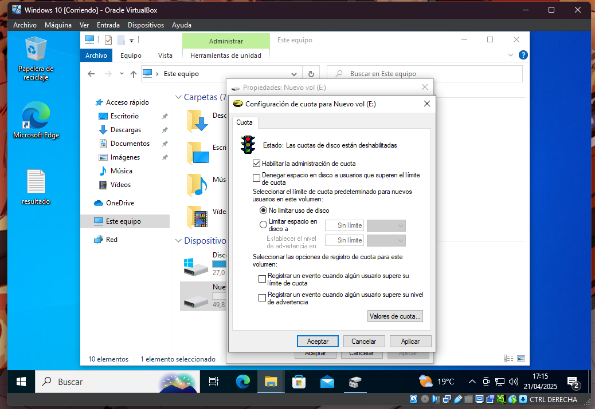

# Cuotas de disco.

## Solo en el disco

Para asiganr una quota a un disco tenemos que abrir el explorador de archivos.

Pulsamos en este equipo.

Pulsamos click derecho en el disco que queramos ponerle una cuota.

Pulsamos en propiedades.

Pulsamos en cuota.

Pulsamos en mostrar conmfiguracion de cuota.

Pulsamos en habilitar la administracion de coutas.

Pulsamos en valores de couta.

Pulsamos en cuota.

Nueva entrada de couta.

Pulsamos en opciones avanzadas y luego pulsamos en buscar ahora

Selecionamos a que usuario le afecta la cuota.

Pulsamos en aceptar.

Cambiamos los KB por GB, le ponemos que limite y cuando advierta

Pulsamos en aceptar.

Cerramos la pestaña.

Pulsamos en aplicar.

Pulsamos en aceptar.

Volvemos a pulsar en aceptar dos veces.

