# Particiones y sistemas de ficheros

Abrimos el buscador y buscamos particiones

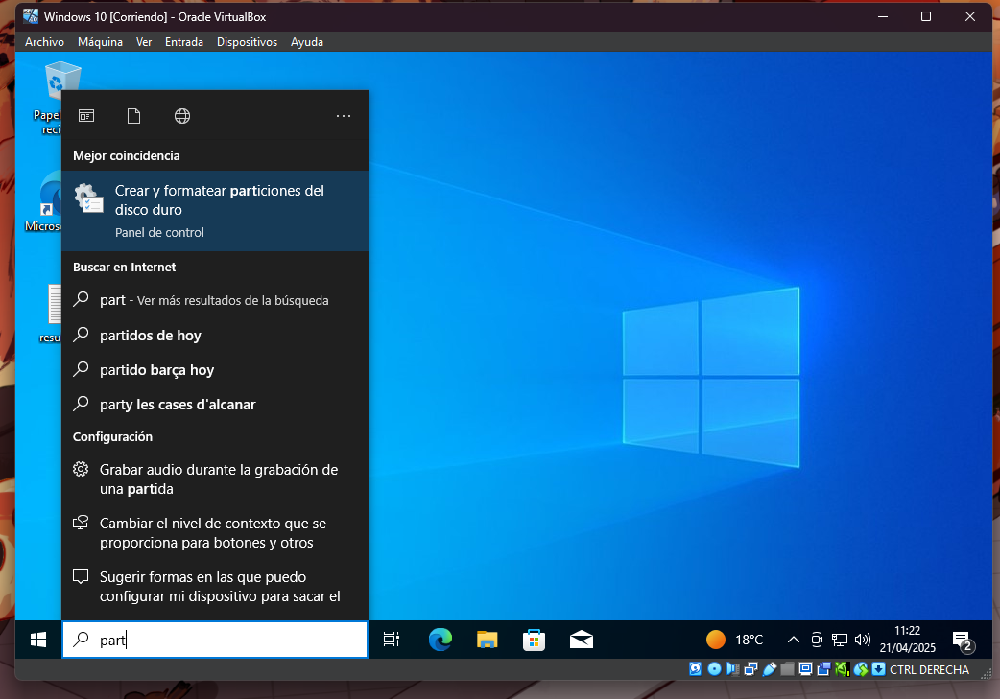

Y abrimos el programa

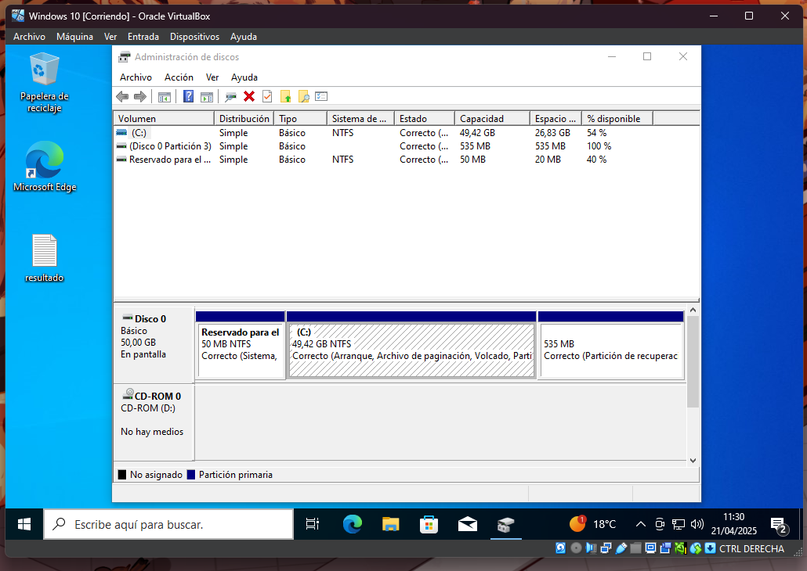

Hacemos click derecho en el volumen del que queremos crear la particion.

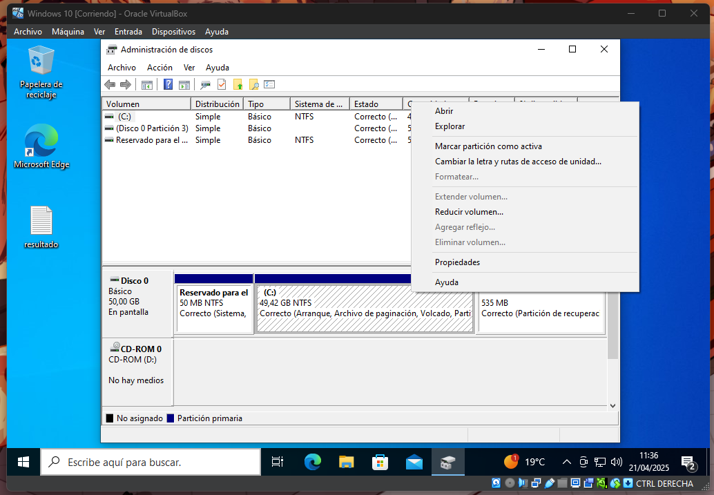

Pulsamos en reducir volumen y ponemos el tamaño de la particion.

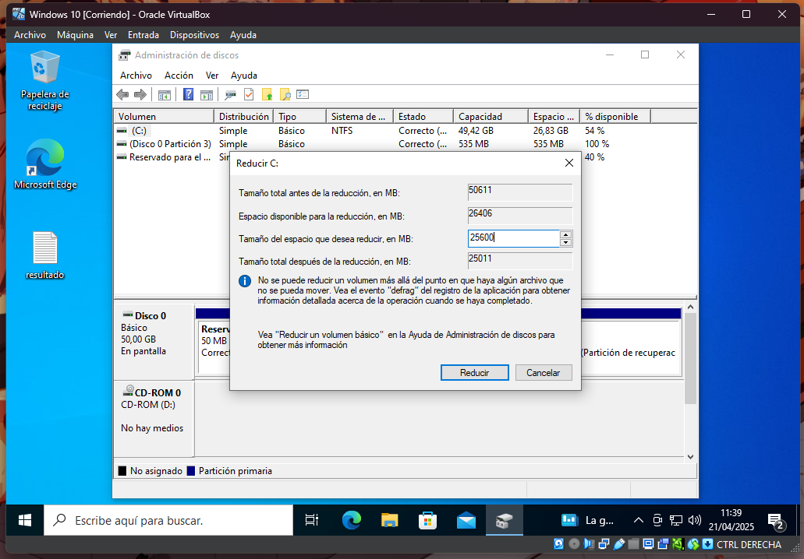

Pulsamos en reducir.

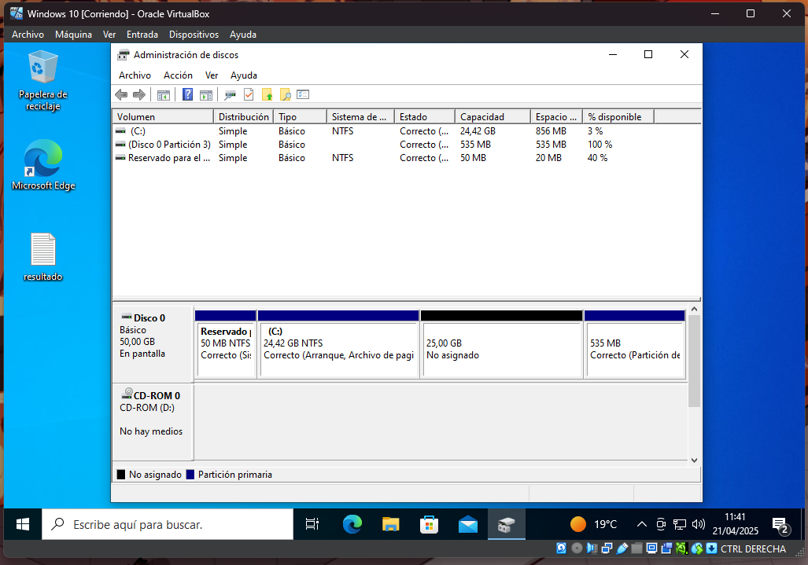

Una vez reducido le podremos dar formato y elegir cual usara la particion. Pulsamos click derecho en la nueva particion.

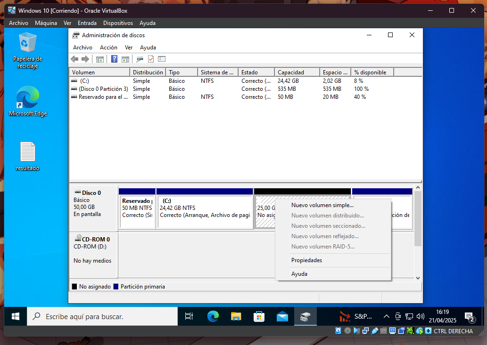

Pulsamos en nuevo volumen simple.

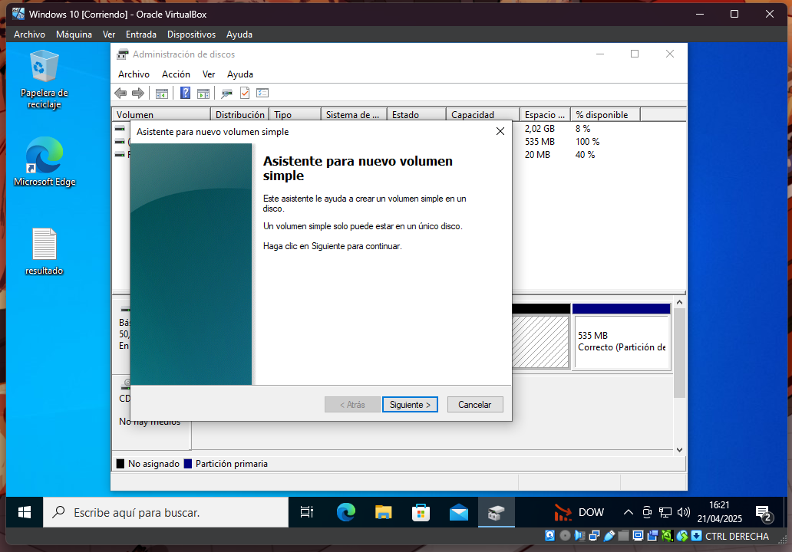

Pulsamos en siguiente.

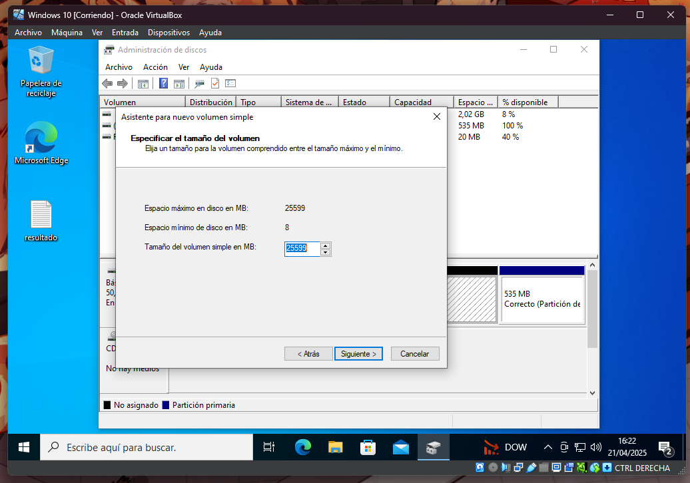

Otra vez en siguiente. En este menu le asignamos la letra que queramos.

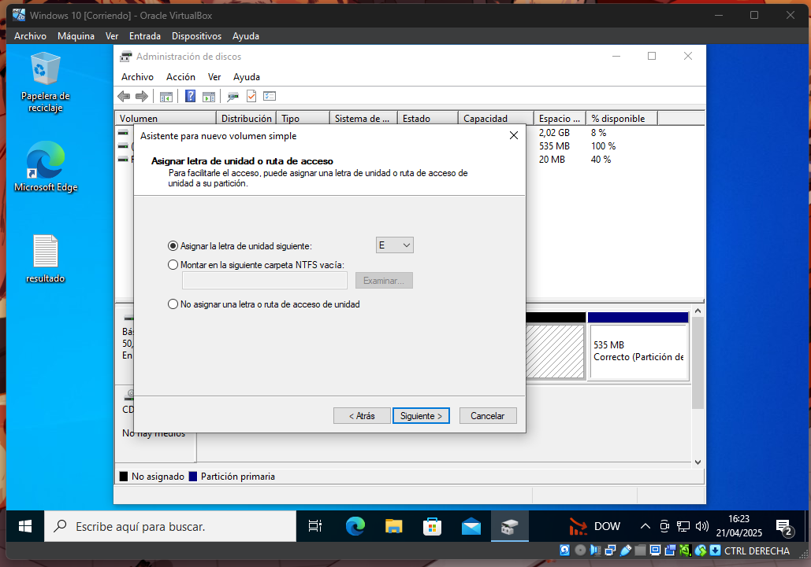

 Pulsamos siguiente. En este menu podemos elegir el sistema de archivos, tamaño de la unidad y el nombre.

 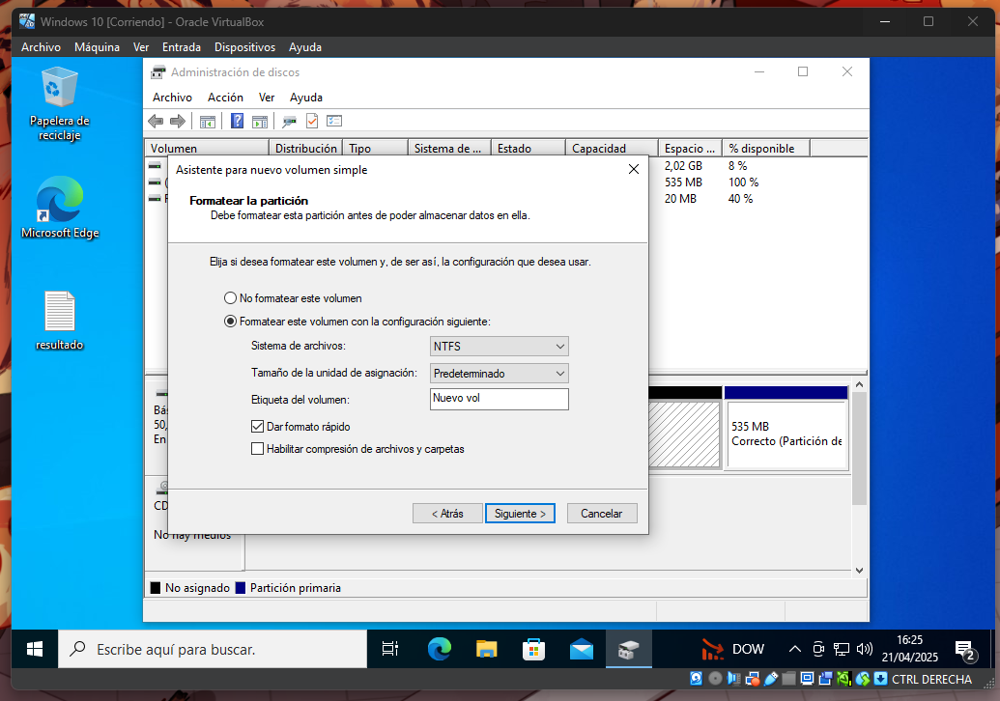

 Por ultimo saldra este menu.

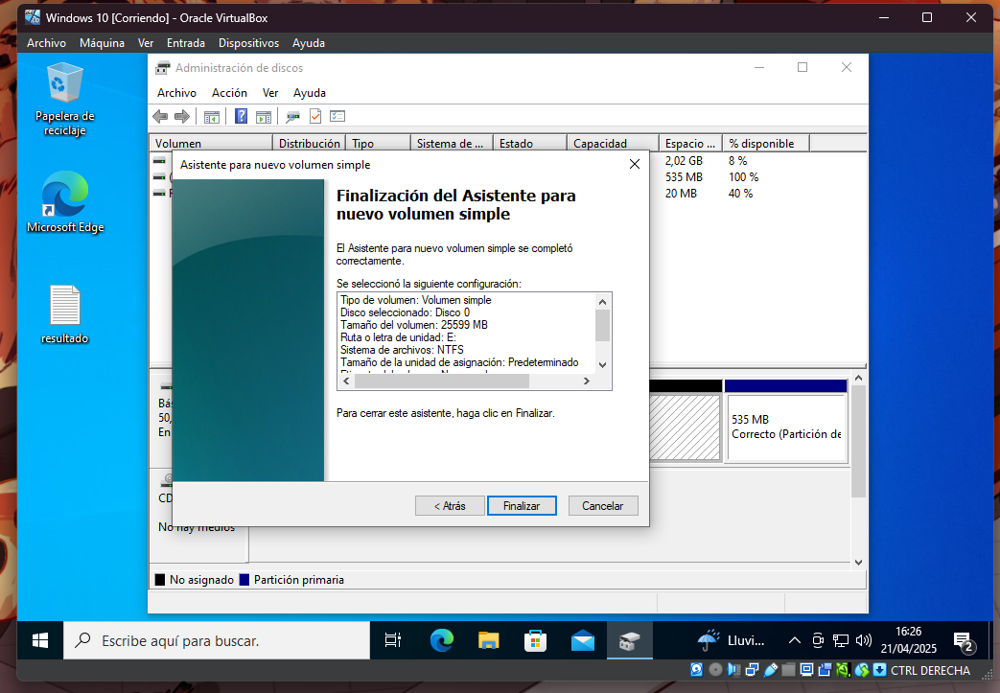

Pulsamos en finalizar.

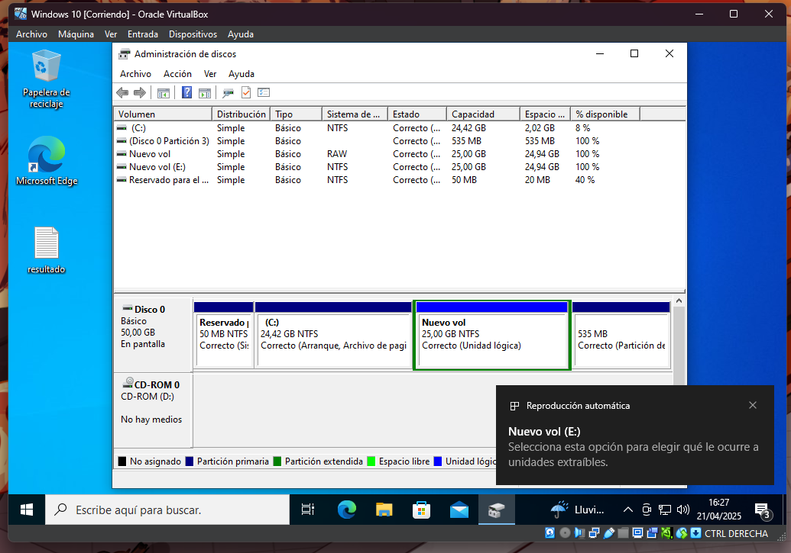

