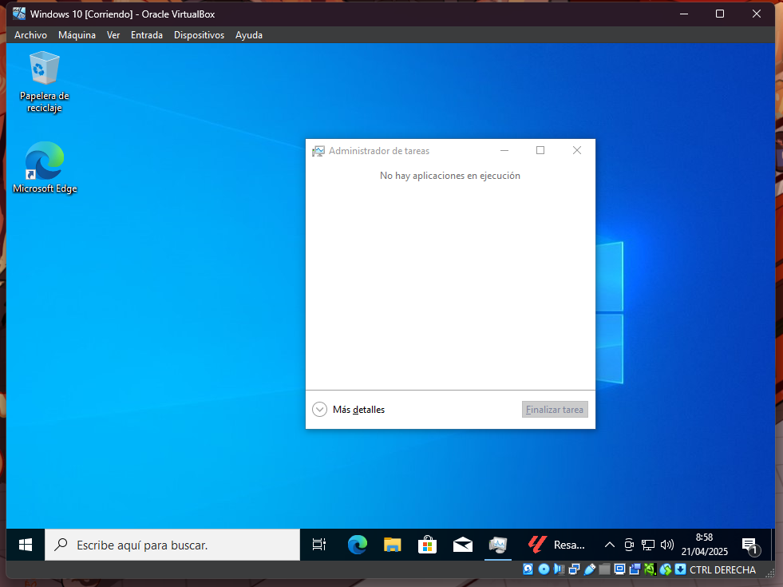
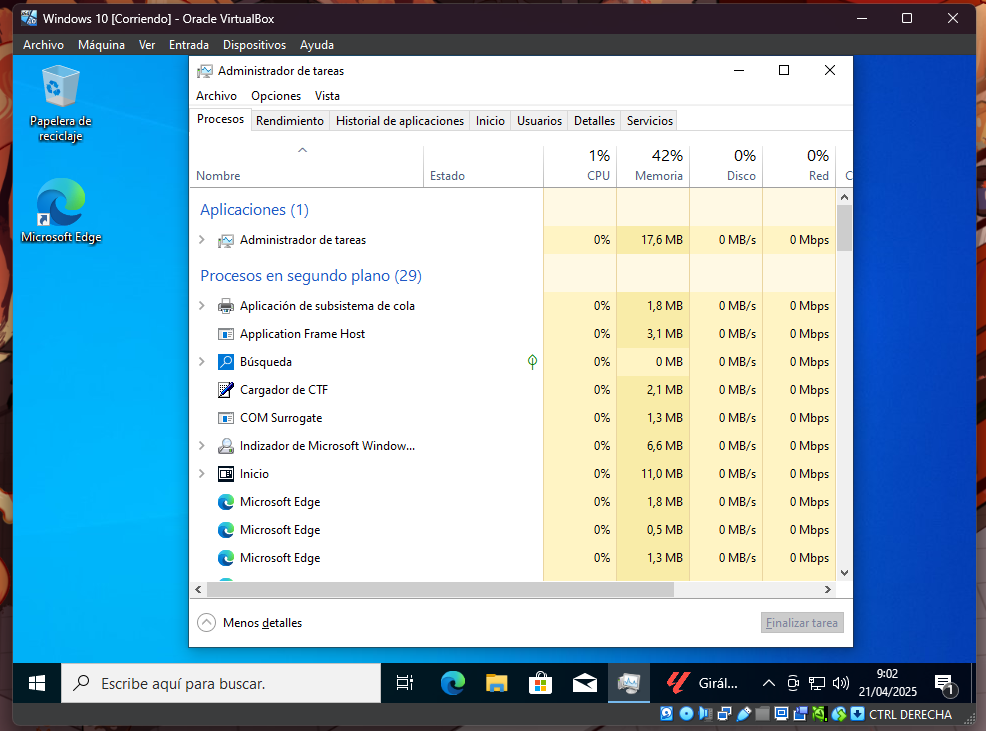
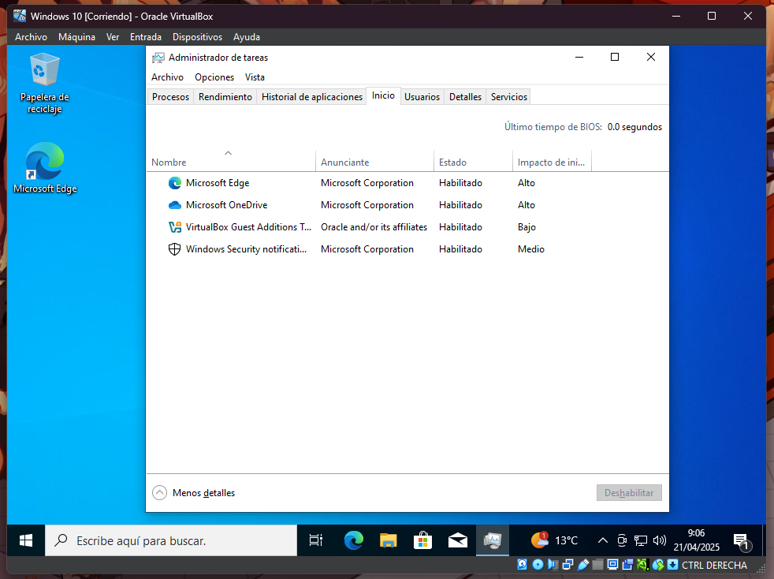
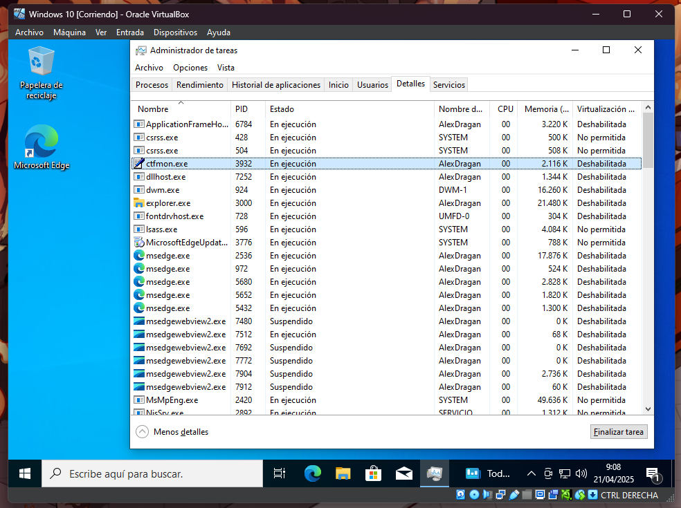
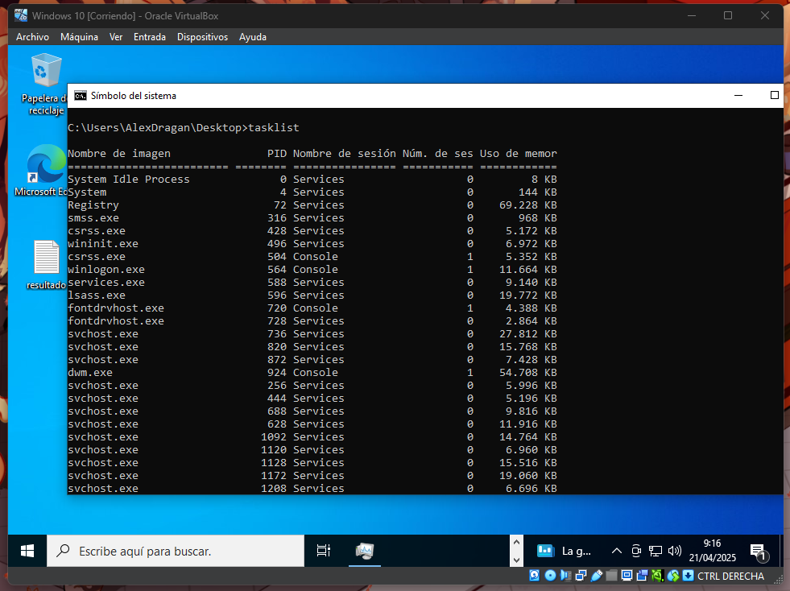
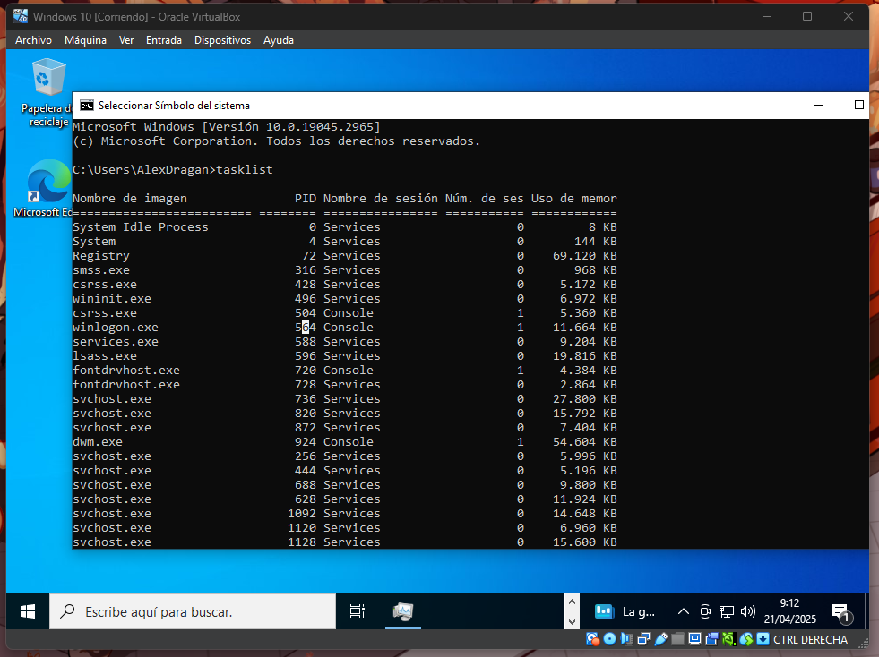
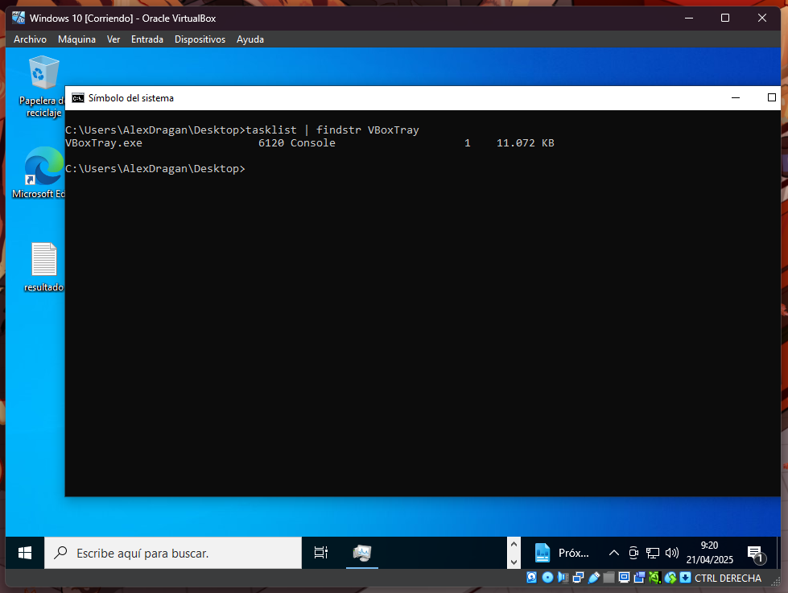
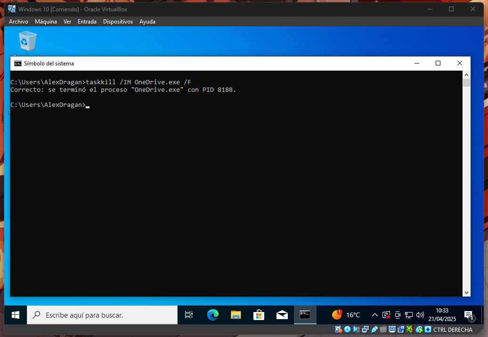

Para la gestion de procesos  se puede hacer tanto por interfaz como cmd.

## Adminstrador de tareas.

Si queremos gestionar los procesos desde la interfaz podemos usar el administrador de tareas.

Pulsamos en mas detalles para poder ver el resto de procesos y funciones.

En inicio podemos ver que procesos se ejecutan al encender el pc.

En el apartado de detalles podemos ver mas informacion sobre los procesos como los PID.

## Tasklist.

En el caso que estemos en el terminal y que queramos ver los procesos que se ejecutan al momentos podemos usar el comando tasklist.

Si queremos por algun motivo guardar el resultado podemos usar >.

Tambien podemos filtrar los procesos poniendo despues del comando | findstr y el nombre del proceso

## Taskkill

Si queremos matar un proceso podemos usar taskkill poniendo /IM y en caso que queremos forzar el finalizado de la tarea podemos usar /f

