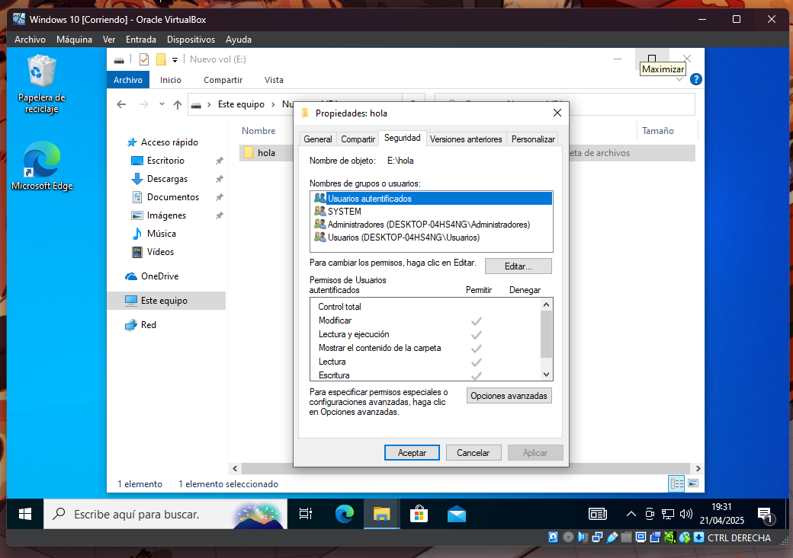

# Grupos, usuarios y permisos

Para crear grupos y usuarios podemos usar varias herramientas que nos proporcionan el propio sistema operativo.

En este caso usaremos el programa cuentas del sistema.

pulsamos la tecla windows + r.

Escribimos.

Y pulsamos enter.

## Creacion de usuarios.

Pulsamos en usuarios.

Hacemos click derecho.

Pulsamos en usuario nuevos.

Desmarcamos la opcion de cambiar la contraseña al iniciar sesion.

Rellenamos los campos que pide.

Marcare la contraseñara nunca expira.

Pulsamos en crear y cerramos el menu. En caso de querer crear mas usuarios al mismo tiempo no cerraremos el menu.

## Creacion de grupos.

Pulsamos en grupos.

Pulsamos click derecho.

Pulsamos en grupo nuevo.

Ponemos el nombre y pulsamos en agregar los usuarios al grupo.

Pulsamos en opciones avanzadas.

Pulsamos en buscar ahora.

Selecinamos el usuario en caso de agregar mas de una vez usar la tecla control y pulsa los que queiras agregar.

Pulsamos en aceptar.

Pulsamos en aceptar.

Por ultimo pulsamos en crear. Igual que en la creacion de usuarios.

## Permisos

Pulsamos click derecho en la carpeta que queremos asignarles los permisos.

Pulsamos en propiedades.

Pulsamos en seguridad.

Pulsamos en opciones avanzada.

Pulsamos en agregar.

Pulsamos en seleccionar una entidad de seguridad.

Pulsamos en opciones avanzadas.

Pulsamos en buscar ahora.

Selecionamos a que le queremos asignar permisos.

Pulsamos en aceptar.

Volvemos a pulsar en iniciar.

Selecionamos los permisos.

Pulsamos en aceptar.

Repetimos la veces que queramos y pulsamos en aplicar. En vez de aplicar tambien tambien puedes hacer el mismo proceso para denegar permisos

Pulsamos en si

Pulsamos en aceptar.

Por ultimo volvemos a pulsar en aceptar.

# Comprobacion 

Lectura 

Escritura

