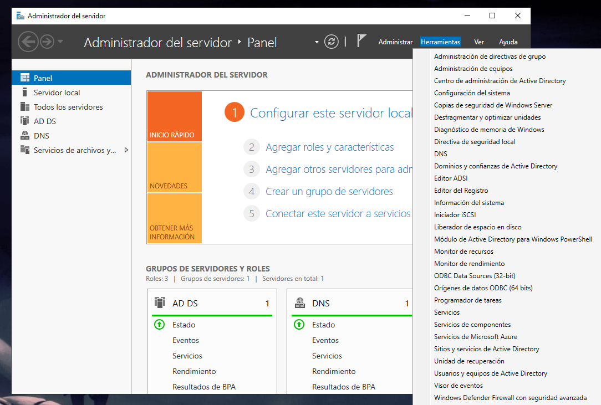

#  Unidades organizativas, Usuarios y grupos.

## Unidades organizativas (UO) 

Las unidades organizativas tambien conocidas como UO son carpetas de active directory que te permiten organizar usuarios, grupos, etc... tambien puedes aplicar politicas de grupo de forma independiente.

Pulsamos en herramientas.

