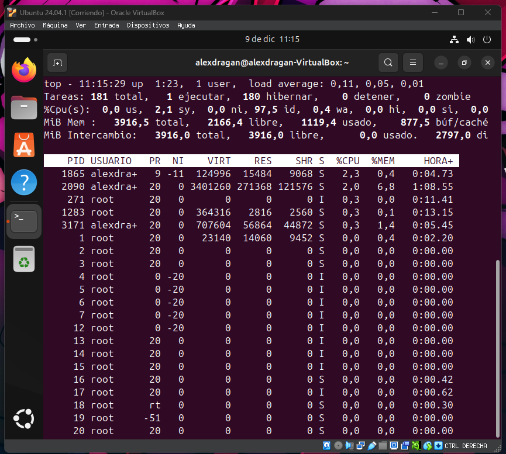
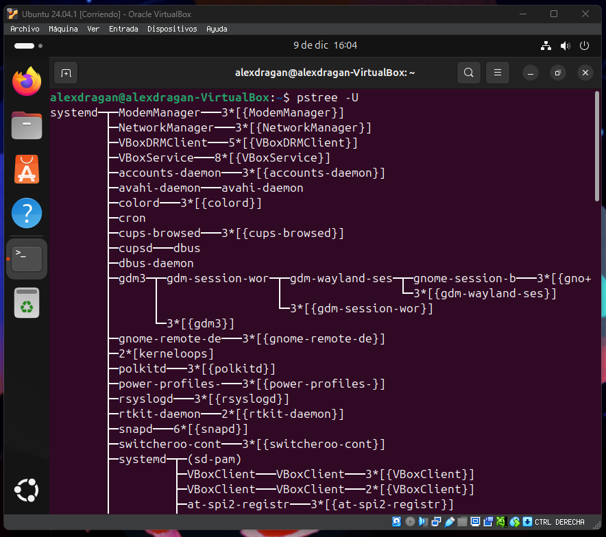
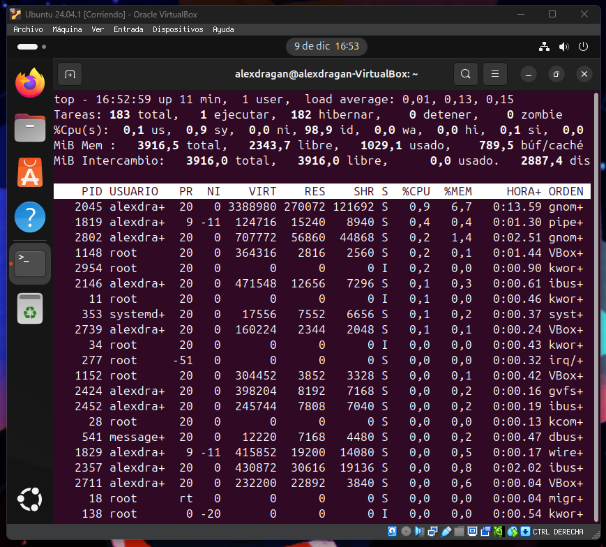

# Gestion de procesos

Los procesos son aquellos programas que se estan ejecutando tanto en primer como segundo plano. 

## top

Te permite ver los procesos que se estan ejecutando desde un terminal.

```
Top
```


## pstree

Te genera un arbol de los procesos.

```
pstree 
```


Puedes usar estos parametros para ordenar o decidir lo que se ve.

## -a o --arguments     

   muestra los argumentos de la línea de órdenes.


## -A o --ascii      

   utiliza characteres de trazado de líneas ASCII.

  

## -c o --compact-not

   no compacta subárboles idénticos.

   

## -C o --color=TIPO    

   colorea proceso por atributo por ejemplo edad.

   

## -g o --show-pgids    

   muestra ids de grupos de procesos; implica -c.

   

## -G o --vt100

   utiliza caracteres de trazzdo de líneas VT100.

   

## -h o --highlight-all 

   resalta el proceso actual y sus ascendientes

   

## -H PID o --highlight-pid=PID 

   resalta este proceso y sus ascendientes

   
                      
## -l o --long

   no trunca las líneas largas

   

## -n o --numeric-sort  
   ordena la salida por PID

   

## -N TYPE o --ns-sort=TYPE

   ordena la salida por este tipo de espacio de nombres (cgroup o ipc o mnt o net o pid o time o user o uts)
    
   

## -p o --show-pids

   muestra PIDs; implica -c

   

## -s o --show-parents  

   muestra los padres del proceso seleccionado
   
   

## -S o --ns-changes 

   muestra las transiciones de espacios de nombres
   
   

## -t o --thread-names  

   muestra los nombres completos de hilos

   

## -T o --hide-threads  

   oculta hilos o muestra solo procesos

   

## -u o --uid-changes    

   muestra transiciones de uid

   

## -U o --unicode    

   utiliza caracteres de trazado de líneas UTF-8 (Unicode)

   

## -V o --version       
  
   muestra información sobre la versión

   

## -Z o --security-context 

   muestra los atributos de seguridad

   

## PID

   inicia en el PID asignado; predeterminado es 1 (init)

   

## USUARIO 

   muestra solo árboles con raíz en los procesos de este usuario

   

## PS AUX

   Muestra los procesos actuales.

   ```
   ps aux
   ```

   

## Ctrl+C y Ctrl+Z

   Ctrl+C Cancela el proceso que se esta ejecuatando.

   

   Ctrl+Z Suspende el proceso que se esta ejecutando.
   
   

## Jobs

   Muestra los procesos que se estan ejecutando en segundo plano o estan detenidos en una sesion de shell.
   
   ```
   jobs
   ```

   

## fg %

   Permite volver abrir el proceso que se ha suspendido.

   ```
   fg %numero
   ```

   

   

## Kill
   
   Sirve para matar procesos

   ```
   kill
   ```

   