# Interfaz grafica Apache directory studio

## Instalacion

Vamos a la web del [apache directory studio](https://directory.apache.org/studio/)

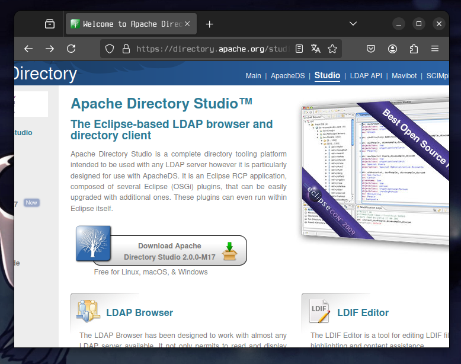

Pulsamos en el boton de download 

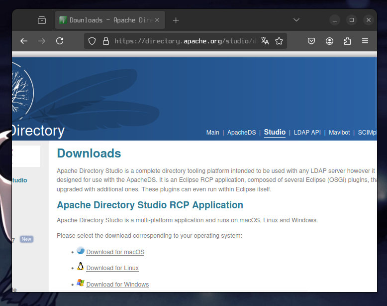

Pulsamos en download for linux.

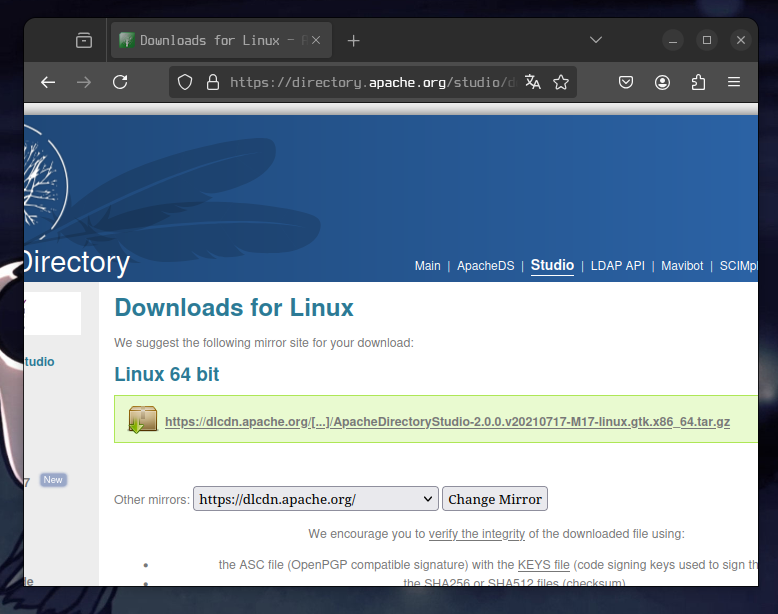

Pulsamos en el enlace que esta en el cuadro verde.

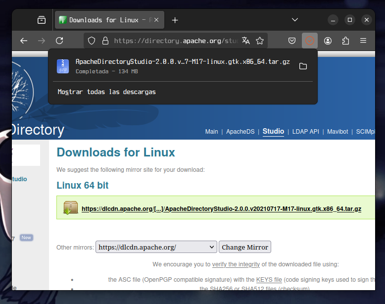

Pulsamos el icono de la carpeta.

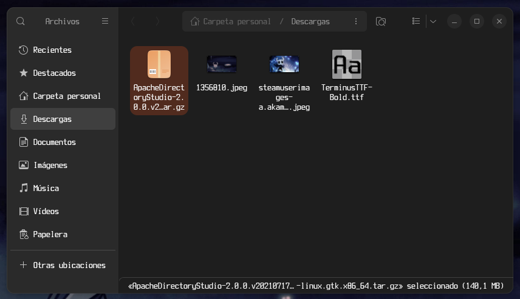

Pulsamos doble clic en el archivo descargado

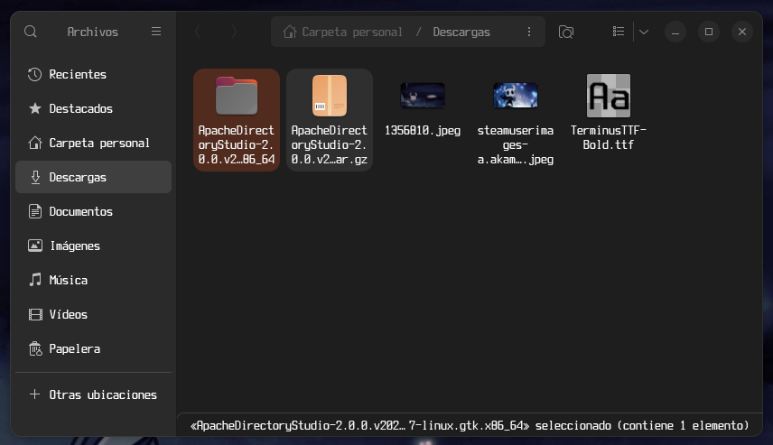

Entramos en la carpeta

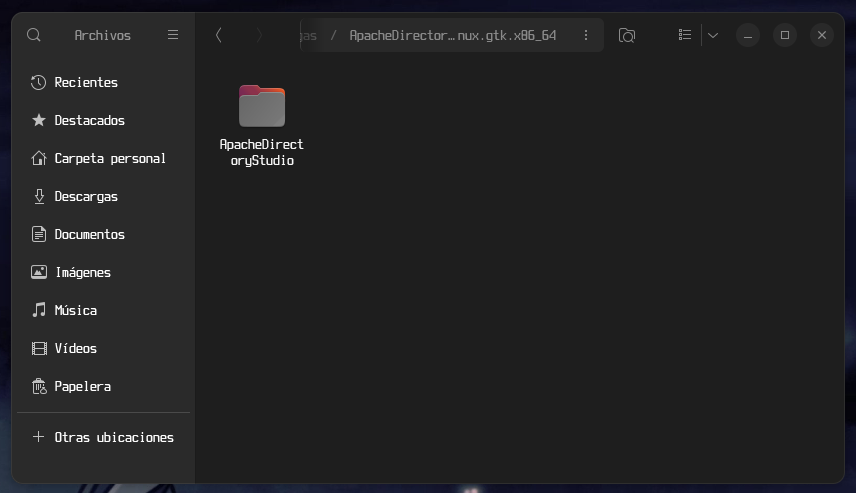

Ahora entramos a la carpeta del programa.

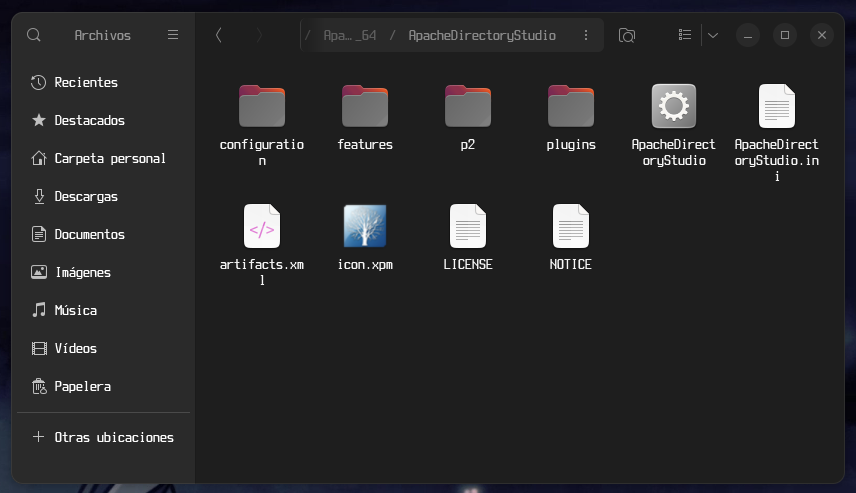

Antes de ejecutar el programa abrimos una terminal con Ctrl+Alt+T para instalar java ejecutando ```apt install default-jre default-jdk```

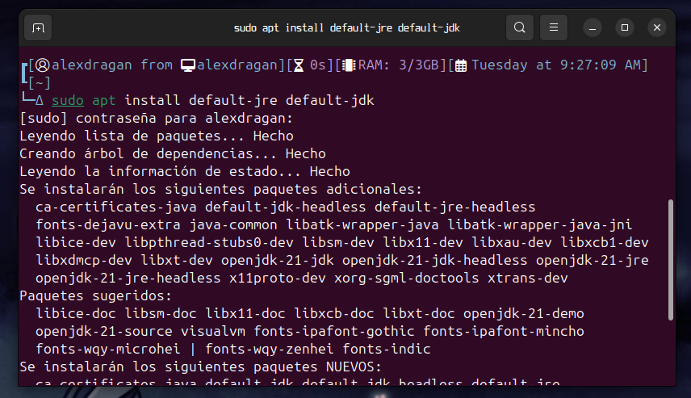

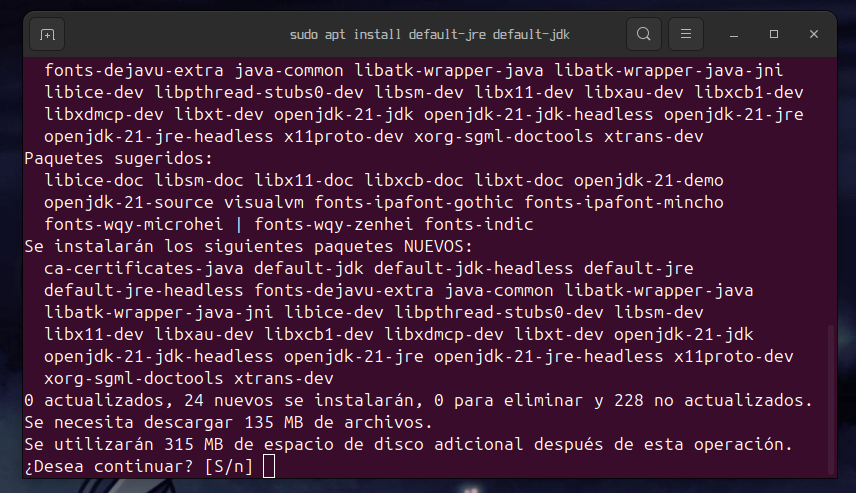

Pulsamos enter.

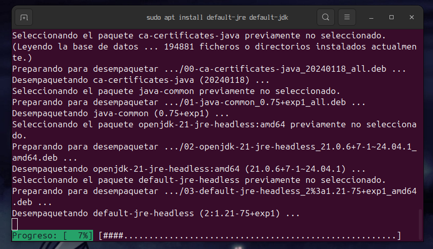

Una vez instalado java podemos cerrar el terminal y ejecutarlo pulsando dos veces en el archivo con el icono de la tuerca o desde el terminal poniendo ```./ApacheDirectoryStudio```.

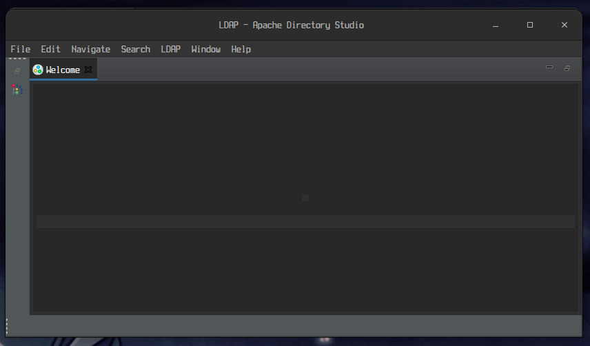

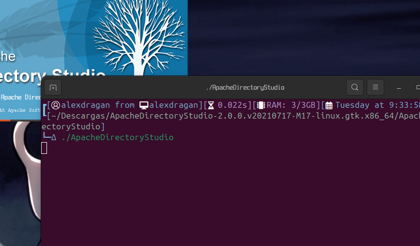

Una vez abierto pulsamos en LDAP 

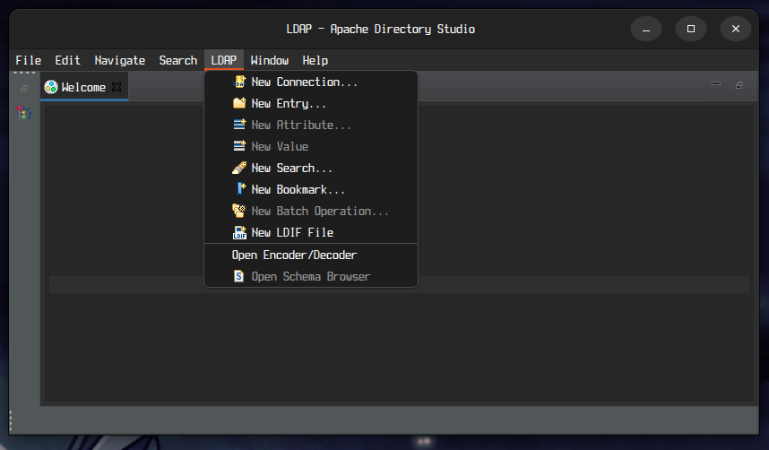

Pulsamos en la opcion new connection

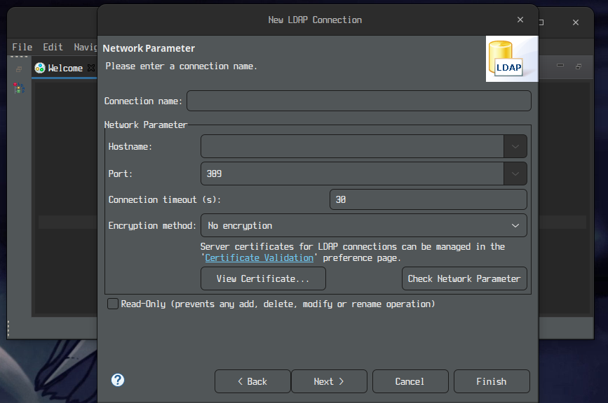

Rellenamos los campos.

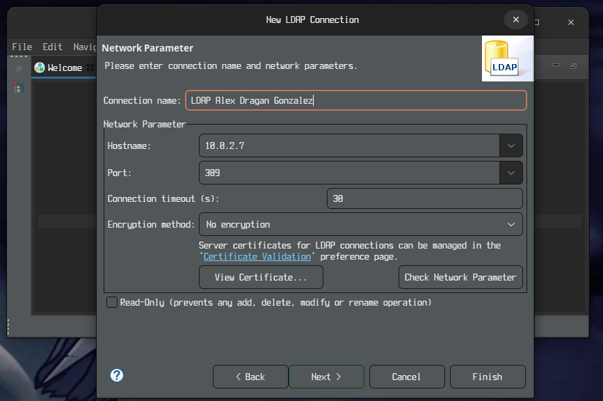

Para comprobar que hemos puesto bien todo pulsamos en check network connection

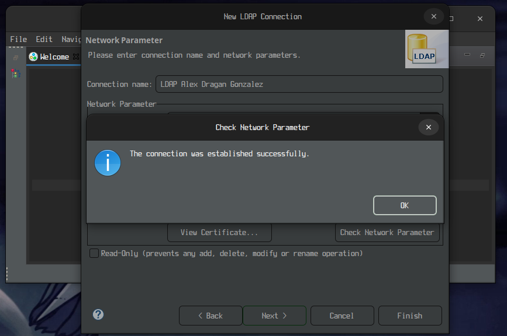

Pulsamos en ok para cerrar el mensaje y luego pulsamos en next

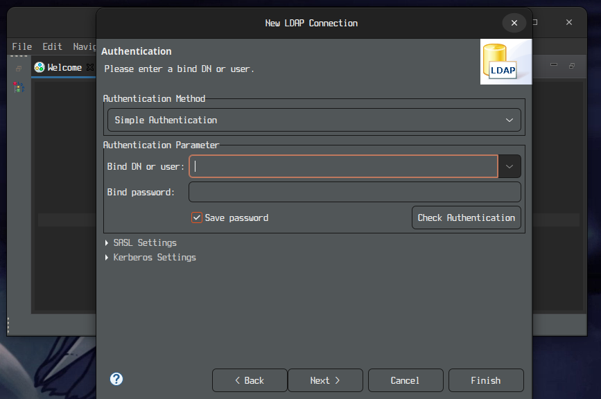

Ponemos el dn y la contraseña.

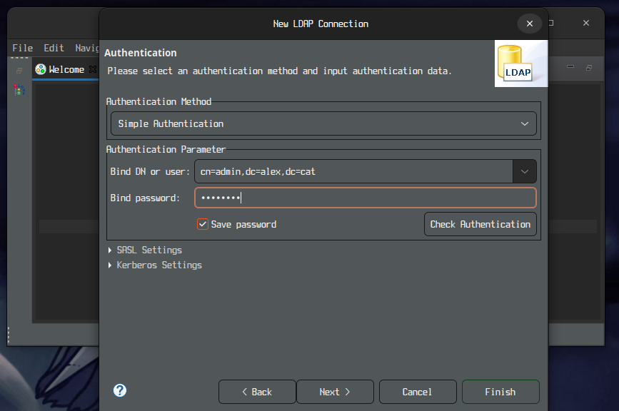

Pulsamos en check Authentication.

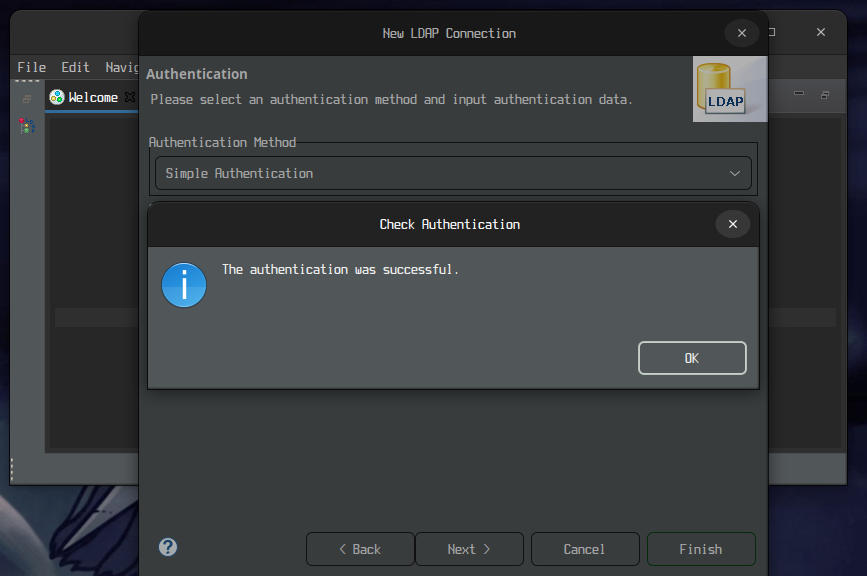

Pulsamos en ok y next.

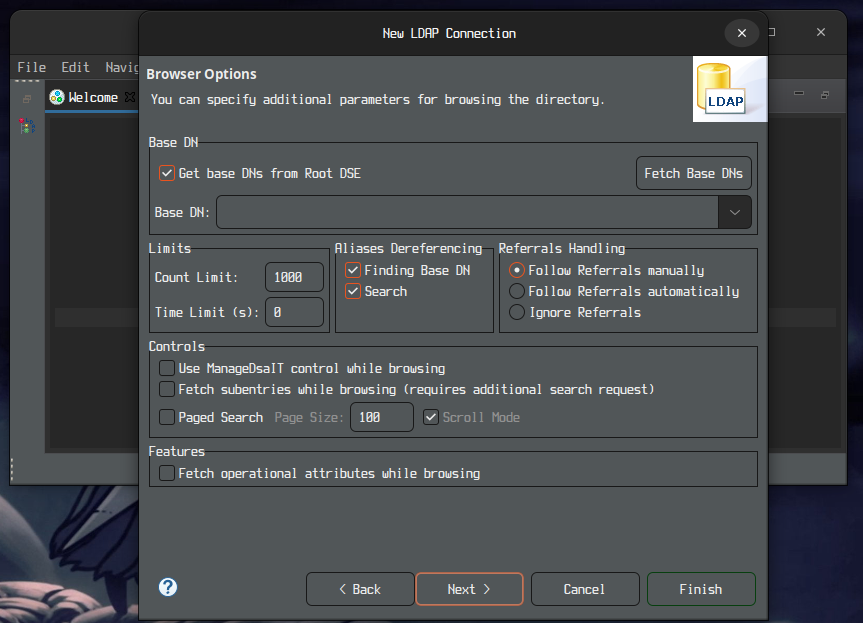

Pulsamos en finish

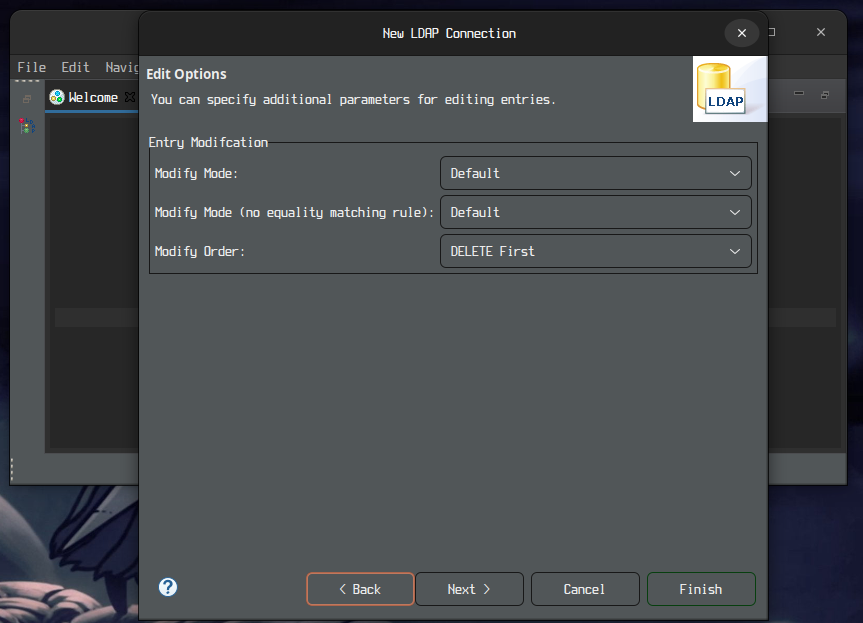
