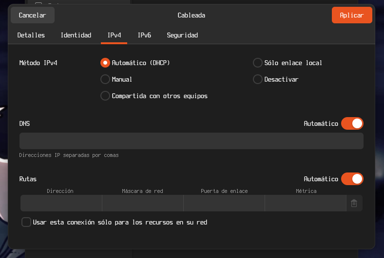
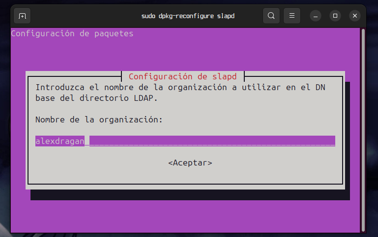
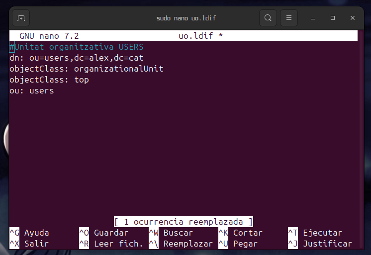

# Instalacion y configuracion

LDAP es un servidor que te permite gestionar diversos dispositivos mediante un dominio.

## Instalacion
Abrimos una terminal con ctrl ctrl + alt + t y ejecutamos el comando.
```
ip a
```

o en caso de tener instalado net-tools.
```
ifconfig
```

Pulsamos en el icono de red.


Pulsamos en la flecha al lado de cableado.


Pulsamos en configurar de red cableada.


Pulsamos en la tuerca.


Pulsar en IPV4



Pulsamos en manual


Asignamos la direccion del ip a o ifconfig, mascara de red, puerto de enalce y DNS


Pulsar en aplicar.


Desconectar el interruptor y volverlo a conectar. En caso de hacerlo en un server abria que modificar un archivo del /etc/netplan y ejecutar el comando ```sudo netplan apply```


Volvemos abrir el terminal editamos el archivo hostname


Guardamos los cambios del archivo.


Ahora tocara editar el archivo /etc/hosts.


en el 127.0.1.1 cambiamos el hostname antiguo al que hemos puesto tambien agregamos una nueva linea con la ip, dominio y hostname de la maquina.


Guardamos el archivo y reiniciamos la maquina.


Descargamos el archivo del moodle y lo extraemos.


Abrimos la terminal y ejecutamos un update.


Ahora instalamos ldap ejecutando el siguiente comando:

```
apt install slapd ldap-utils
```


Ponemos la contraseña del administrador.


Volvemos a poner la contraseña.


Ejecutamos este comando para ver si se instalo bien

```
slapcat
```


## Configuracion

Ahora ejecutamos el siguiente comando.

```
dpkg-reconfigure slapd
```


Pulsamos no


Pulsamos enter y saldra este menu.


ponemos el nombre de la organizacion.



En el siguiente menu pondremos la contrsae de administrador.


Pulsamos enter y en el siguiente menu volvemos a poner la misma contraseña


Aparecera el siguiente menu cuando pulsamos enter.


Selecionamos en si y pulsamos enter.


Pulsamos enter.


Ahora ejecutamos ```slapcat``` para comprobar que esta bien configurado.


Vamos a los archivos descargados y lo editamos.


cambiamos los dc por el nuestro en los archivos siguientes:

uo.ldif:



grup.ldif:


usu.ldif:


Guaradamos y ejecutamos el siguiente comando para añadir los archivos:

```
ldapadd -c -x -D "cn=admin,dc=lo_que_has_puesto,dc=nombre_de_dominio" -W -f nombre_archivo.ldif
```

ou.ldif:


grup.ldif:


usu.ldif:


Para comprobar que todo funciono bien volvemos a ejecutar slapcat.


