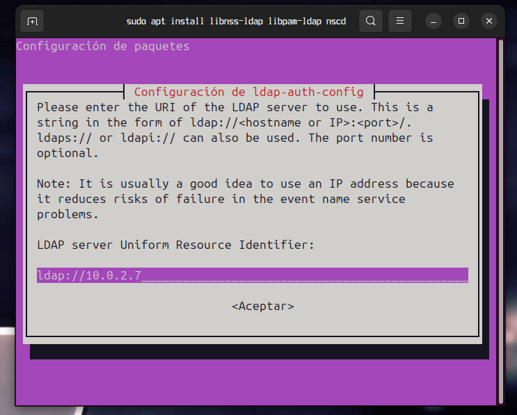
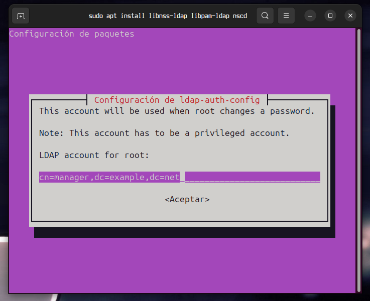
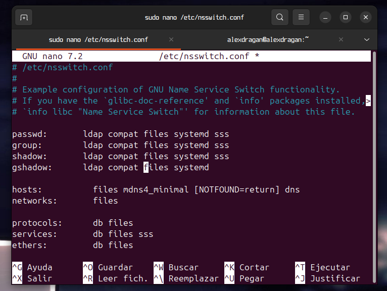

# Unir al dominio

Ejecutamos un sudo apt update.


Ahora ejecutamos el comando

```
apt install libnss-ldap libpam-ldap nscd
```


Pulsamos enter y saldra este menu. Tendremos que poner ldap//tu_ip.


Pulsamos enter.



cambiamos el example y el net por lo que hemos puesto.


Pulsamos enter.


Volvemos a pusar enter.


volvemos a puslar enter otra vez


Otra vez enter.


Marcamos si y luego pulsamos enter.



Saldra este menu donde cambiaremos el manager por admin y el dc por lo que hemos puesto.


En el siguiente menu tendremos que poner la contraseña que hemos puesto en ldap.


En el siguiente menu cambiamos toca cambiar el proxyuser por otro usuarios como solo tengo un usuario usare el admin pero en un caso real se tiene que usar otro.


Pulsamos en enter y en el siguiente menu ponemos la contraseña.


Una vez configurado iremos al archivo nsswitch.conf y lo editaremos paraque ubuntu consulte los usuarios de ldap.



Guardamos el archivo y ahora editaremos el archivo common-session.


Por ultimo editaremos el archivo 50-ubuntu.conf para poder iniciar sesion on el usuario de ldap.


Si queremos comprobar que el usuario existe hacemos un getent passwd


Reiniciamos la maquina para aplicar los cambios y ahora podremos iniciar sesion con el usuario tanto desde terminal como interfaz grafica.

Terminal


Interfaz grafica:

Estando en el menu de incio de sesion usaremos la opcion no esta en la lista.


Escribimos el usuario y pulsamos enter.


Escribimos contraseña.


Si todo a salido bien habras accedido al alu1.


