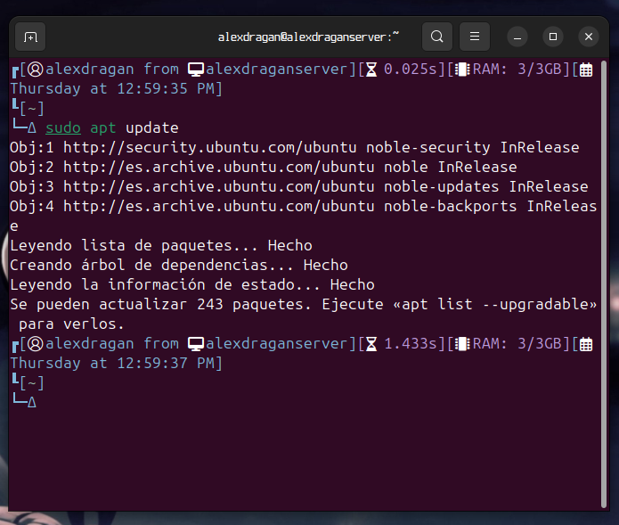
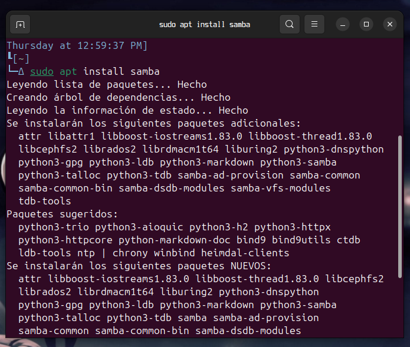
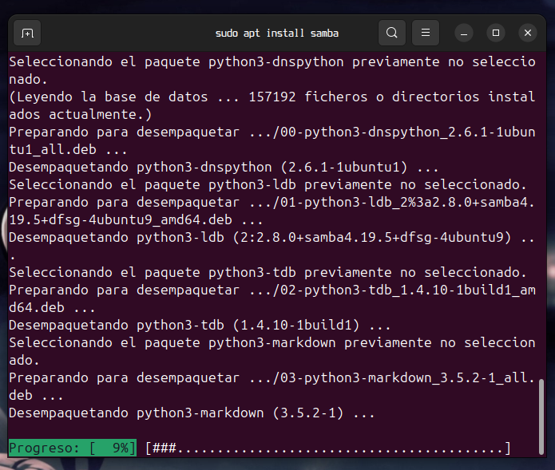
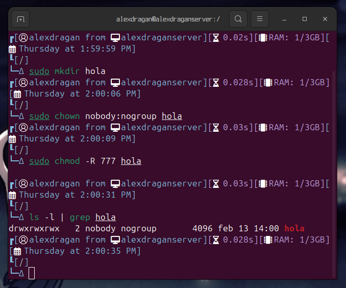
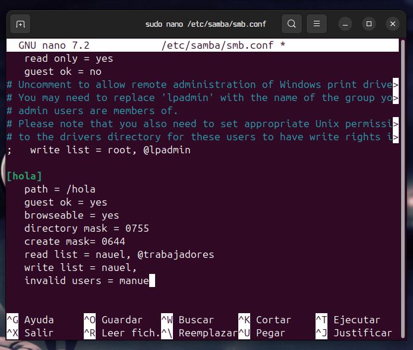
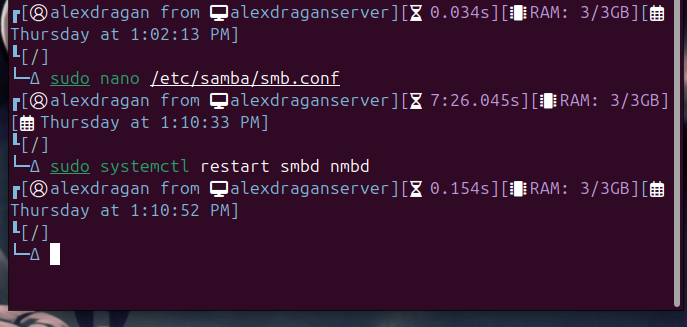
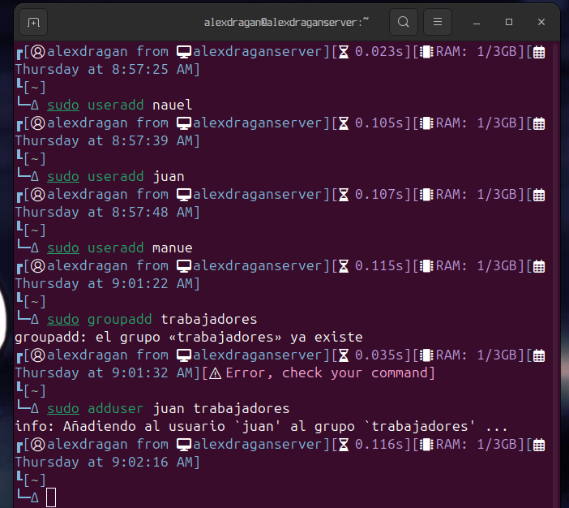
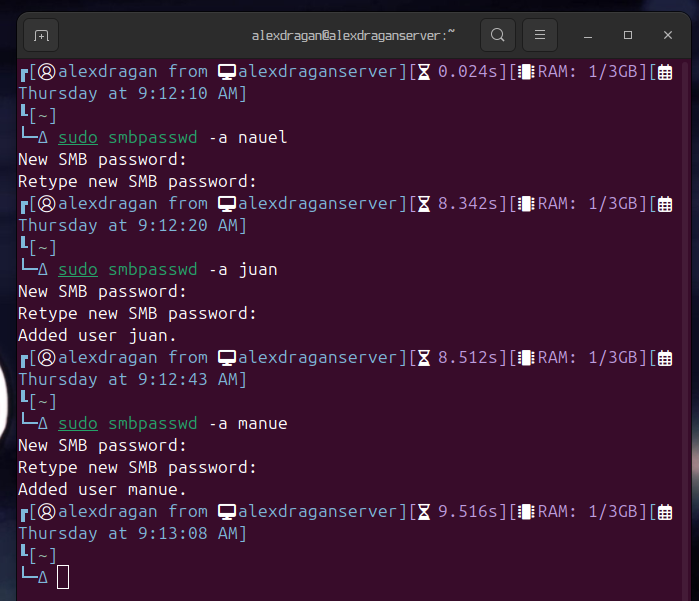
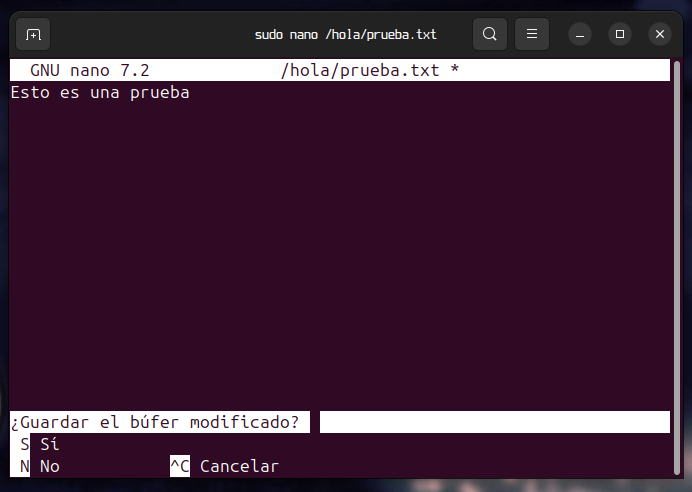

# Instalar y configurar samba server

## Instalar

Primero ejecutar un sudo apt update.



Una vez hecho el update instalamos el samba





Una vez instalado vamos a la carpeta raiz, creamos una carpeta y ejecutamos estos comandos

```
sudo mkdir hola

sudo chown nobody:nogroup carpeta que has creado

sudo chmod -R 777 carpeta creada

sudo chmod -R 777 carpeta creada

ls -l | grep carpeta creada
```


## Configuracion

Ahora iremos a editar el archivo smb.conf y agregaremos las siguientes lineas.



Guardamos los cambios y reiniciamos el samba.



Ahora creamos los usuarios y grupo.



Ahora ejecutamos el comando.



Creare un archivo de prueba.


