# Instalacion de samba en el cliente y pruebas

## Instalacion

Ejecutamos un sudo apt update.

Ahora instalamos samba client.

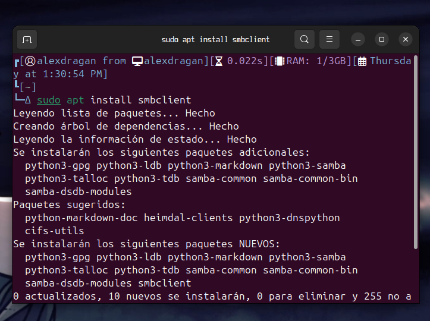

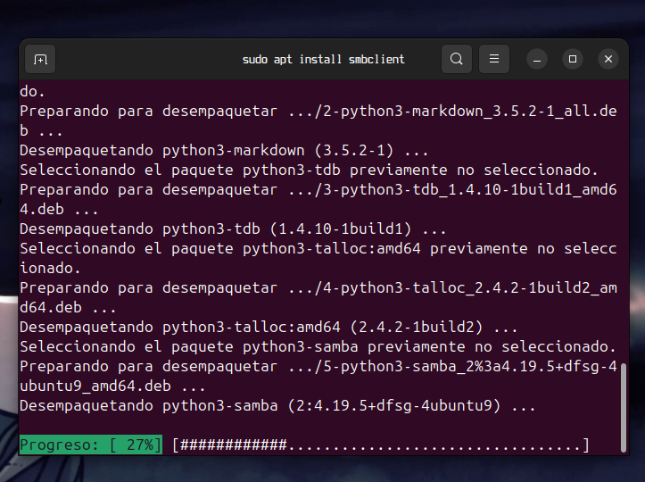

Y ahora para acceder abrimos el gestor de archivos, escribimos smb://ip_del_server/carpeta creada

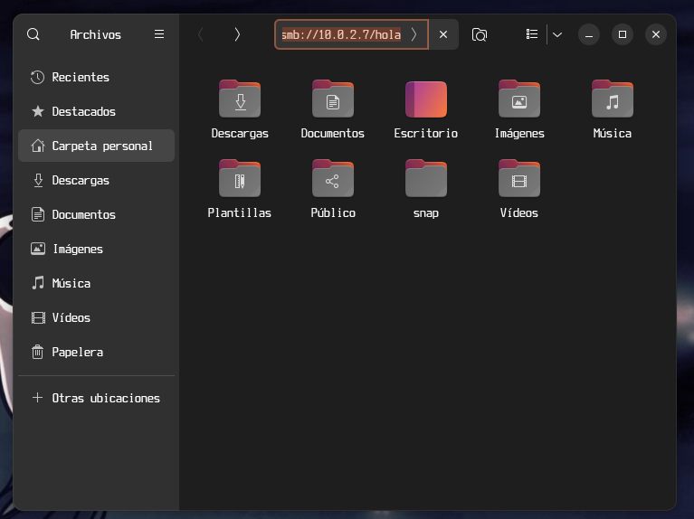

## Prueba guest

Prueba lectura

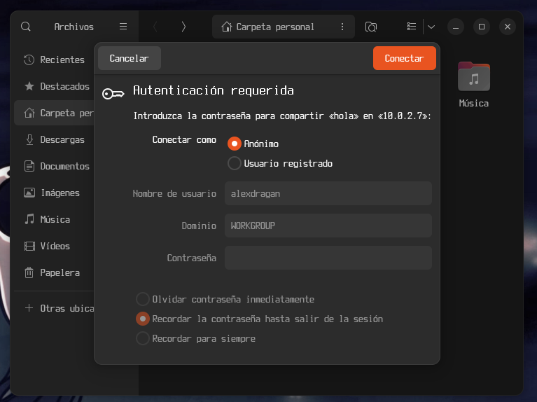

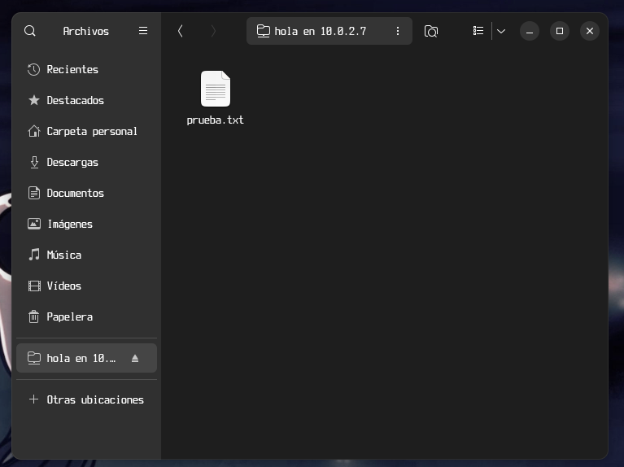

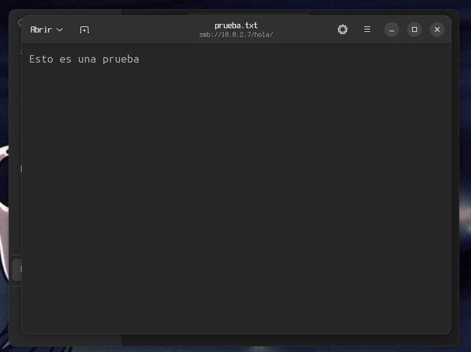

Prueba escritura

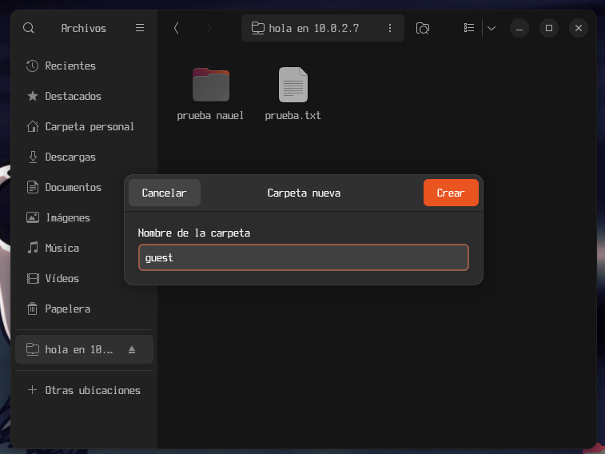

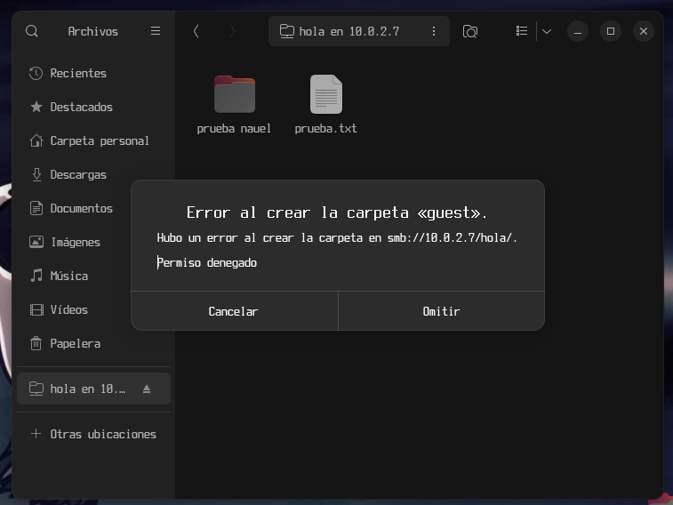

## Prueba Usuarios registrados

Usuario Nauel

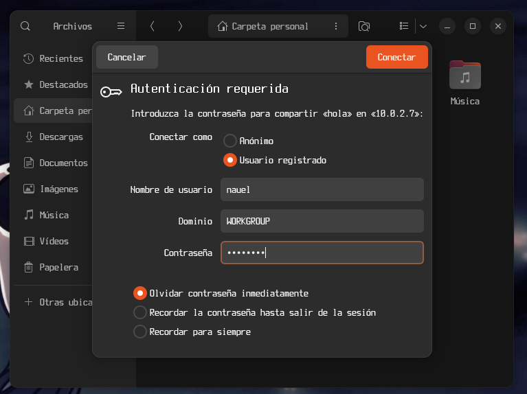

Prueba lectura

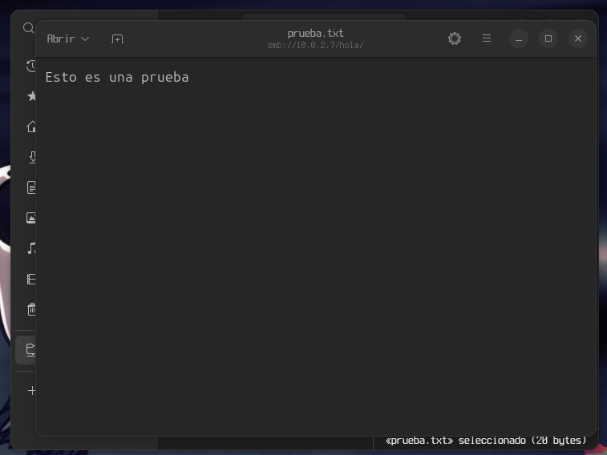

Prueba escritura 

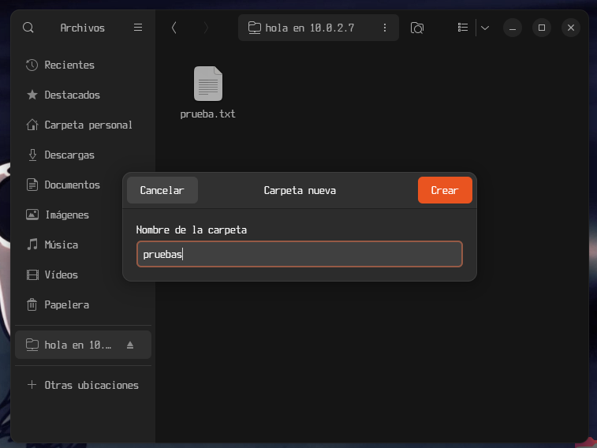

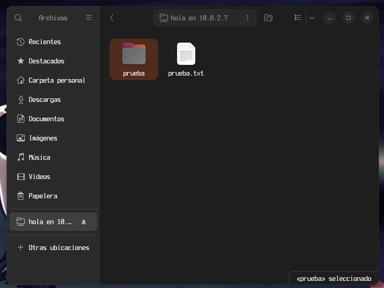

Usuario manue

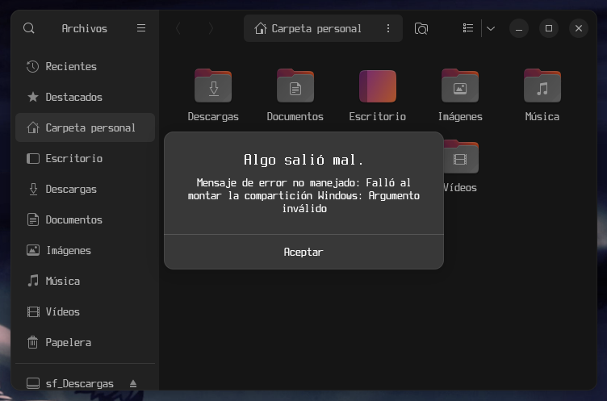

Usuario Juan

Prueba de lectura

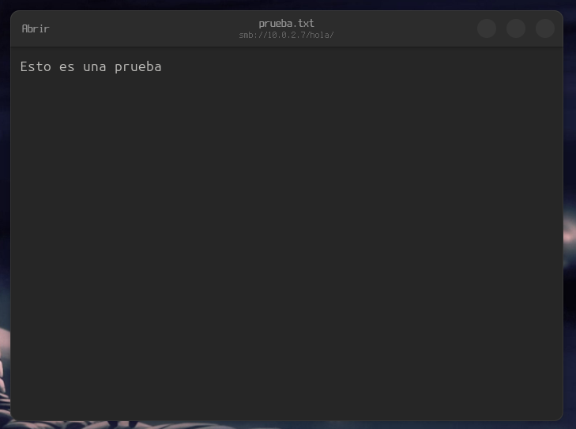

Prueba escritura

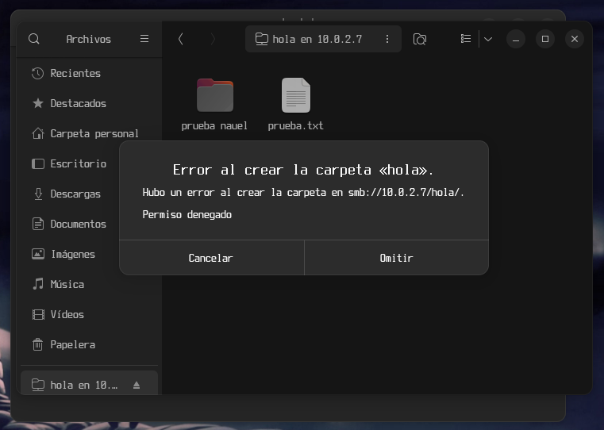
